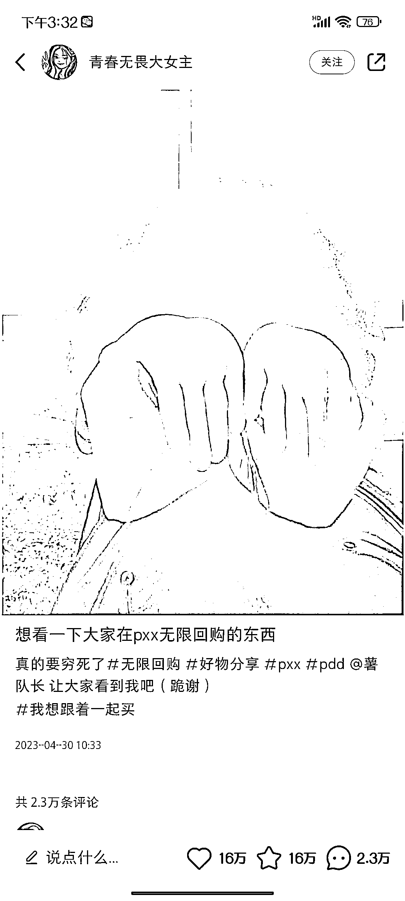

# 小红书最强钩子：一张照片，一句话，32 万赞藏

> 原文：[`www.yuque.com/for_lazy/xkrm14/ip6ngbl6o0ucttgb`](https://www.yuque.com/for_lazy/xkrm14/ip6ngbl6o0ucttgb)

作者： 木子猫

日期：2023-06-19

点赞数：117

<ne-hole id="uad685ca0" data-lake-id="uad685ca0">

正文：

一张照片，一句话，32 万赞藏。 目前刷到的最强钩子。博主起个头，话题一带动，后面没她什么事了。

  <ne-p id="udae0be48" data-lake-id="udae0be48">  <ne-hole id="ufc672beb" data-lake-id="ufc672beb"><ne-p id="ubdbd0ef3" data-lake-id="ubdbd0ef3">评论区：

初见 : 拼夕夕流量确实可以，我小红书唯一火的一篇就是拼夕夕推荐好物

胖大魔 : 最好用的钩子

Mr. Lucky : 有自己产品或店铺的，很适合在这类评论区推广，找两三个小号相互铺垫，发截图，然后跟进体验式好评，效果应该会不错

兰心 : 最近刷到很多这样的账号

橘子小姐 : 博主变现吗？

Yue : 这种账号接下来如何变现呀

贝壳 : 一堆广告在她评论区，接下来怎么变现了

<ne-hole id="u329920f0" data-lake-id="u329920f0">

公众号懒人找资源，懒人专属群分享

</ne-hole></ne-hole></ne-p></ne-p></ne-hole>