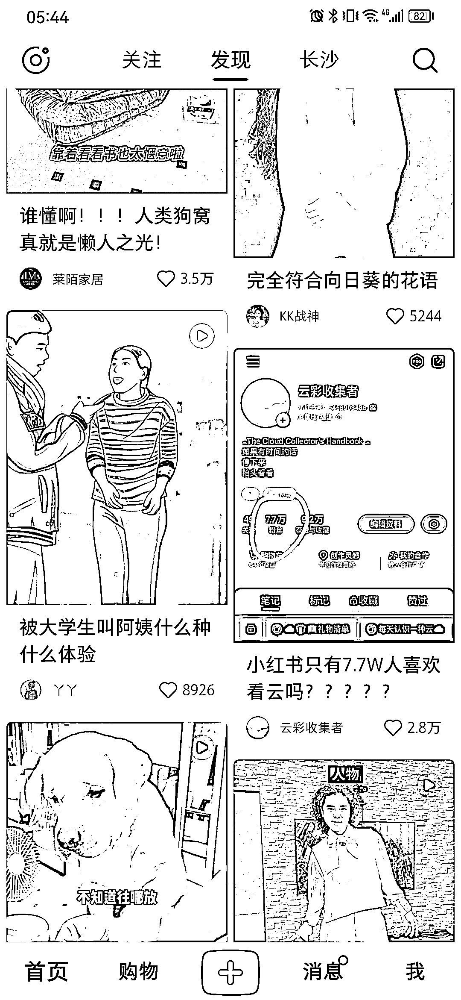

# 小红书一天涨粉 7.7 万，反向推广自身获关注

> 原文：[`www.yuque.com/for_lazy/xkrm14/spmgpfub3gmcbg98`](https://www.yuque.com/for_lazy/xkrm14/spmgpfub3gmcbg98)

作者： 大梁

日期：2023-06-22

点赞数：64

正文：

小红书最近流行推广自己，一天涨粉 7.7 万 这个话题很火爆，反向推广自己获得关注，提前是要展示值得被关注的价值，再用这个爆款标题吸引点击

评论区：

咏 : 16W 了

超 : 这个博主，我前两天也刷到了，粉色真是爆拉，一下就十几万粉丝了，内容平平无奇，笔记挂了一本云彩收集的书籍 22.5，卖了 800 多单。

大鱼 : 20 年三十而已播出后 知道云彩收集这个概念 还有一些微信群小伙伴们一起分享各种云彩什么的 人们都是趋向美好的事物的 这个方向准没错

公众号懒人找资源，懒人专属群分享

