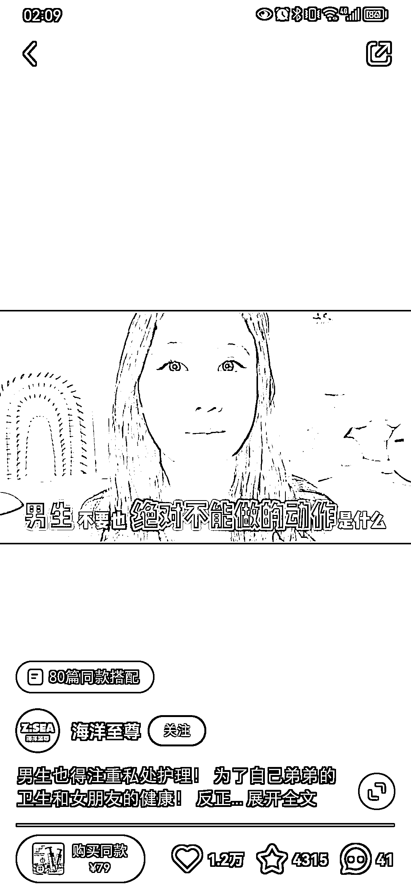

# 小红书女性用户购买男士私处护理液，拓宽选品思路

> 原文：[`www.yuque.com/for_lazy/xkrm14/ikgephh8gnwxmhcr`](https://www.yuque.com/for_lazy/xkrm14/ikgephh8gnwxmhcr)

作者： 大梁

日期：2023-06-24

点赞数：54

<ne-hole id="u121ad23b" data-lake-id="u121ad23b">

正文：

小红书选品男士私处护理液，没想到这种品也有销量还挺高，这是男生不太可能关注和购买的产品，说明小红书上女性用户也会给男朋友老公买产品，针对这个案例可以拓宽我们的选品思路

<ne-hole id="ud4f97abb" data-lake-id="ud4f97abb">

评论区：

胖大魔 : 从男的全身一块肥皂，到制造消费需求[呲牙]

王益友 : 不买这玩意，几元钱的硫磺皂比这好用吧

Jun : 感觉这玩意是真智商税

胖大魔 : 有精致的猪猪男孩需要的

王炯 : 我就买过[捂脸]

<ne-hole id="u44fe6e93" data-lake-id="u44fe6e93">

公众号懒人找资源，懒人专属群分享

</ne-hole></ne-hole></ne-hole>