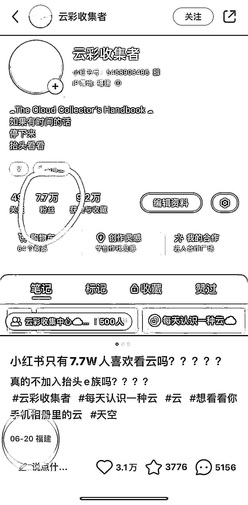
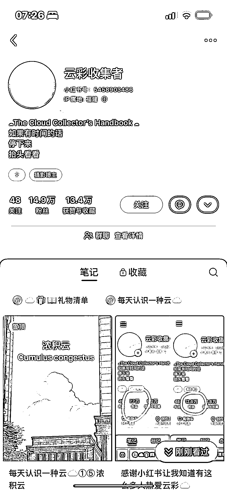

# 小红书上自我推荐，涨粉快速

> 原文：[`www.yuque.com/for_lazy/xkrm14/br5nh2r2sy5fh26q`](https://www.yuque.com/for_lazy/xkrm14/br5nh2r2sy5fh26q)

作者： 郭小帅

日期：2023-06-22

点赞数：48

<ne-hole id="u0de1373a" data-lake-id="u0de1373a">

正文：

一早上在小红书刷到 2 个，自己推荐自己可还行？2 天涨粉 1 个 7w+，一个 3w+ 标题都是反问式，只有 xx 人喜欢 xx 吗？

  <ne-p id="ub267f8e4" data-lake-id="ub267f8e4">  <ne-p id="u4806be46" data-lake-id="u4806be46">  <ne-p id="ua8561b48" data-lake-id="ua8561b48">  <ne-hole id="u49fa13c5" data-lake-id="u49fa13c5"><ne-p id="u35a6ec5b" data-lake-id="u35a6ec5b">评论区：

怪力小乔巴 : 没想明白这个云彩收集的号通过啥来变现[捂脸]

郭小帅 : 我也不知道，盲猜粉丝多了卖号？

<ne-hole id="uf2b2735e" data-lake-id="uf2b2735e">

公众号懒人找资源，懒人专属群分享

</ne-hole></ne-hole></ne-p></ne-p></ne-p></ne-p></ne-hole>