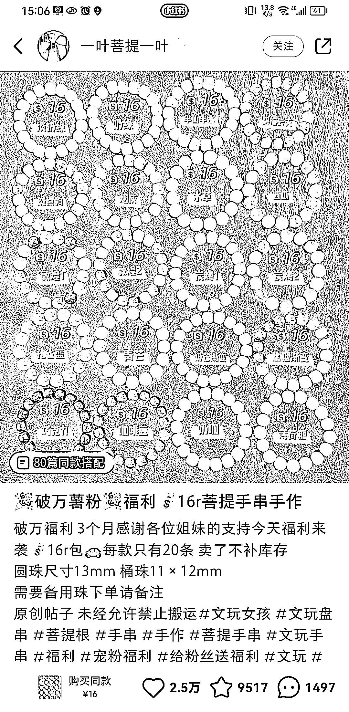
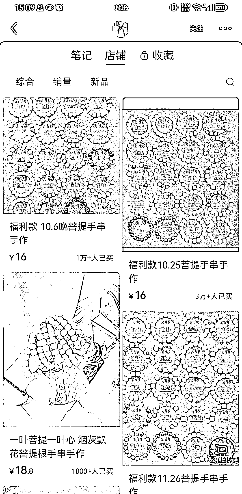

# 早中晚发笔记+玄学手作赛道+低客单价＝高销量小红书店铺

> 原文：[`www.yuque.com/for_lazy/xkrm14/fo0fahlha4c0clg9`](https://www.yuque.com/for_lazy/xkrm14/fo0fahlha4c0clg9)

作者： 波本零

日期：2023-06-22

点赞数：45

正文：

早中晚发笔记+玄学手作赛道+低客单价＝高销量小红书店铺 虽然这个手作菩提手串的客单价平均才 20 左右，但这个账号每篇标题都是当天日期+早中晚+“菩提手串手作”的关键词，发久了自然而然会吸引对玄学饰品感兴趣的学生党。薄利多销，现在店铺的平均销量都已经过万了。

评论区：

篮子🍀 : 这个拿货价挺便宜的诶

鲁西西 : 在哪里拿货呢？

篮子🍀 : 义乌商贸城

… : 这种低客单价退货率怎么样

远方 : 在哪 我就在义乌商贸城

公众号懒人找资源，懒人专属群分享

