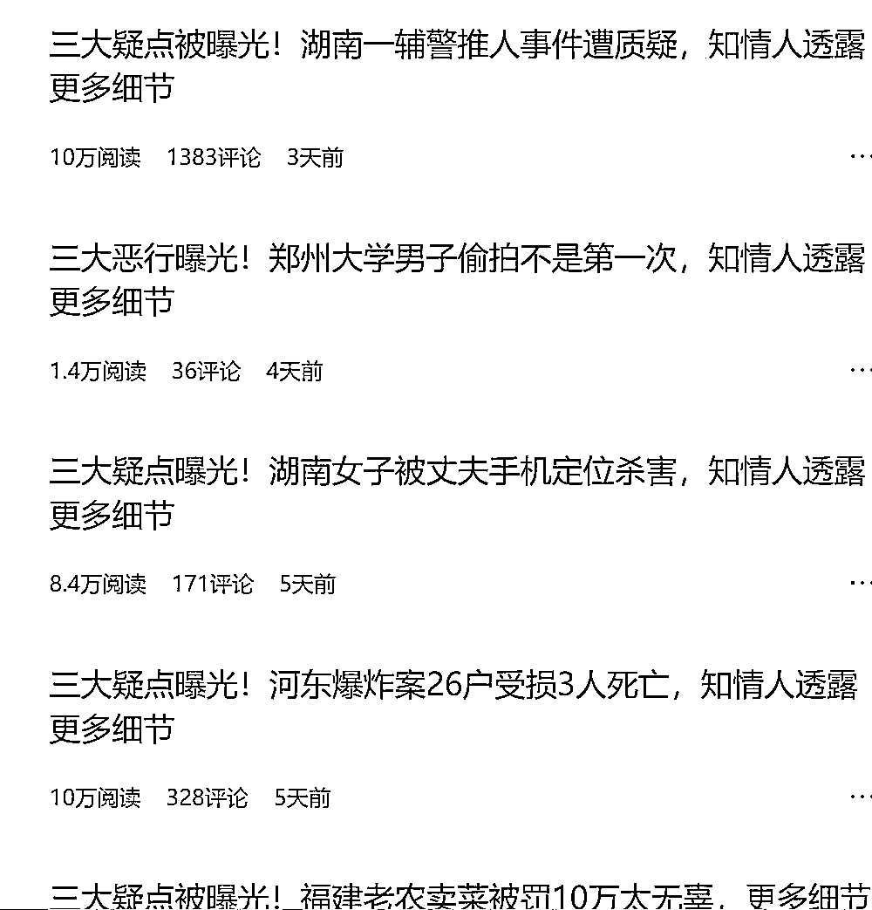

# 追热点必备的标题套路，让你的文章爆红

> 原文：[`www.yuque.com/for_lazy/xkrm14/fhpctex0vg13r424`](https://www.yuque.com/for_lazy/xkrm14/fhpctex0vg13r424)

<ne-p id="u8cc77436" data-lake-id="u8cc77436"><ne-text id="ufd3805b3">作者： 安隐</ne-text></ne-p> <ne-p id="u5cbe2bc3" data-lake-id="u5cbe2bc3"><ne-text id="u2319deda">日期：2023-06-19</ne-text></ne-p> <ne-p id="u195e222b" data-lake-id="u195e222b"><ne-text id="u395cdd95">点赞数：</ne-text><ne-text id="ud61dd1a6" ne-bold="true">139</ne-text></ne-p> <ne-hole id="u75bcbd43" data-lake-id="u75bcbd43"><ne-card data-card-name="hr" data-card-type="block" id="CUDRe" data-event-boundary="card"><ne-p id="u6f14bd62" data-lake-id="u6f14bd62"><ne-text id="u5750b1d2">正文：</ne-text></ne-p> <ne-p id="u70f6c362" data-lake-id="u70f6c362"><ne-text id="u2bc69b3a">追热点超好用的标题套路</ne-text> <ne-text id="u7f3de703">在头条发现一个 6 月 8 号开始起号的账号，用这个标题套路，起号第一篇 8.8w，后面大部分都是 8w+、10w+阅读量，爆文写作赛道的同学可以借鉴一下。</ne-text></ne-p> <ne-p id="u3dbf02ba" data-lake-id="u3dbf02ba"><ne-card data-card-name="image" data-card-type="inline" id="agqIr" data-event-boundary="card">  <ne-hole id="ue535a607" data-lake-id="ue535a607"><ne-card data-card-name="hr" data-card-type="block" id="xjgM5" data-event-boundary="card"><ne-p id="ucb019a4e" data-lake-id="ucb019a4e"><ne-text id="u932c1f10">评论区：</ne-text></ne-p> <ne-p id="u2fc7c41e" data-lake-id="u2fc7c41e"><ne-text id="uaa1dfc8f">胖大魔 : 牛皮！！！学习了</ne-text></ne-p> <ne-p id="ub3faed7a" data-lake-id="ub3faed7a"><ne-text id="u6fbaa8f4">悦佬 : [强]</ne-text></ne-p> <ne-p id="uf0641c29" data-lake-id="uf0641c29"><ne-text id="u6857591d">从小就很帅 : 强，学习了</ne-text></ne-p> <ne-p id="u644e7a1c" data-lake-id="u644e7a1c"><ne-text id="uc45fbf60">晨希 : 学到了，感谢分享</ne-text></ne-p> <ne-p id="u175d58ac" data-lake-id="u175d58ac"><ne-text id="u7074e6ab">达不溜， : 这心理抓的</ne-text></ne-p> <ne-hole id="u772c8b99" data-lake-id="u772c8b99"><ne-card data-card-name="hr" data-card-type="block" id="TcZei" data-event-boundary="card"><ne-p id="ue61655c9" data-lake-id="ue61655c9"><ne-text id="u5c0693b5">公众号懒人找资源，懒人专属群分享</ne-text></ne-p></ne-card></ne-hole></ne-card></ne-hole></ne-card></ne-p></ne-card></ne-hole>