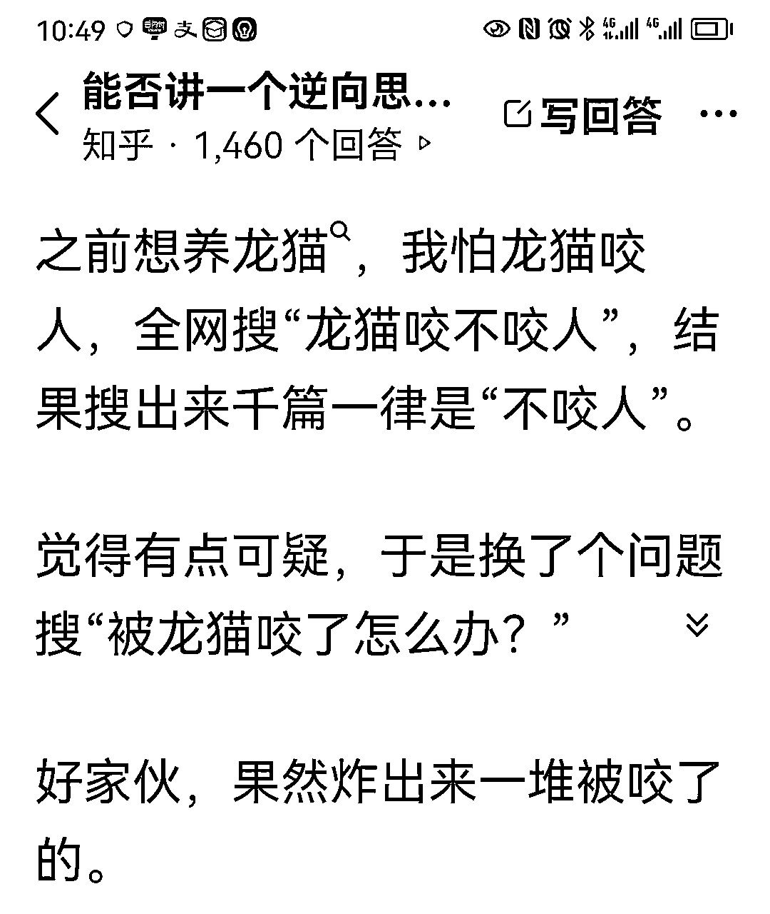
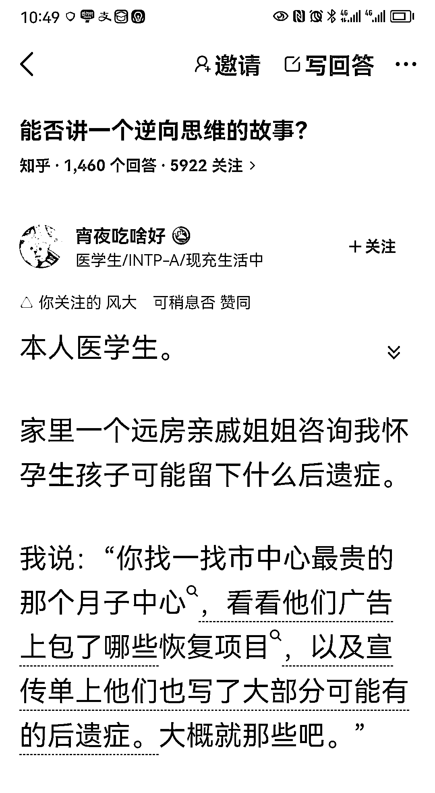

# 逆向思维揭示售前与售后信息的差异

> 原文：[`www.yuque.com/for_lazy/xkrm14/soqbgmaefqcnamo3`](https://www.yuque.com/for_lazy/xkrm14/soqbgmaefqcnamo3)

<ne-p id="u4d3a23ec" data-lake-id="u4d3a23ec"><ne-text id="u90f9e857">作者： 大勇非勇</ne-text></ne-p> <ne-p id="u7e16fb58" data-lake-id="u7e16fb58"><ne-text id="u0a4c7c3f">日期：2023-06-24</ne-text></ne-p> <ne-p id="ubb9961ab" data-lake-id="ubb9961ab"><ne-text id="u53815cc2">点赞数：</ne-text><ne-text id="ue80ed5ee" ne-bold="true">131</ne-text></ne-p> <ne-hole id="u42f66a45" data-lake-id="u42f66a45"><ne-card data-card-name="hr" data-card-type="block" id="m6Gzz" data-event-boundary="card"><ne-p id="ub1a3951d" data-lake-id="ub1a3951d"><ne-text id="u855f27b7">正文：</ne-text></ne-p> <ne-p id="u7ea3c5e7" data-lake-id="u7ea3c5e7"><ne-text id="uaa501405">在知乎上看到一篇简短的回答，关于“逆向思维”。 其中突显了“售前信息”与“售后信息”的明显差异。</ne-text> <ne-text id="u2d1dd8fb">如果直接问“会不会怎样”，链接到的就是售前信息——更多的得到营销性信息。</ne-text> <ne-text id="u1aff9dff">如果改成问“xx 了怎么办”，链接到的就是售后信息——更多的实际信息，以及真正的痛点，还有可能的服务点。 总结：问对问题，才能得到正确答案。</ne-text></ne-p> <ne-p id="u13115d15" data-lake-id="u13115d15"><ne-card data-card-name="image" data-card-type="inline" id="fE0R9" data-event-boundary="card">  <ne-p id="ubc53e9dd" data-lake-id="ubc53e9dd"><ne-card data-card-name="image" data-card-type="inline" id="bd790" data-event-boundary="card">  <ne-hole id="uc4fa3b48" data-lake-id="uc4fa3b48"><ne-card data-card-name="hr" data-card-type="block" id="dpD7o" data-event-boundary="card"><ne-p id="ub8dafc0a" data-lake-id="ub8dafc0a"><ne-text id="ufaa88c80">评论区：</ne-text></ne-p> <ne-p id="ufa37caee" data-lake-id="ufa37caee"><ne-text id="ue7d9981b">小鸣 : 太牛了</ne-text></ne-p> <ne-p id="u67cb074a" data-lake-id="u67cb074a"><ne-text id="uc27dae72">胖大魔 : 妙啊！！！</ne-text></ne-p> <ne-p id="u5a66ddd4" data-lake-id="u5a66ddd4"><ne-text id="u8edfbf5f">胖大魔 : 好问题搜出好答案，逆向思维妙用</ne-text></ne-p> <ne-p id="u32d6511f" data-lake-id="u32d6511f"><ne-text id="ucad119e6">安然小姐 : 在购物场景，预设该产品/服务可能存在的 bug，去获取对应的反馈，看看自己能否接受反馈中最差的那条，能接受的话，大概率不会踩雷。</ne-text></ne-p> <ne-hole id="u3ffe4392" data-lake-id="u3ffe4392"><ne-card data-card-name="hr" data-card-type="block" id="EeIbF" data-event-boundary="card"><ne-p id="u1955ceb7" data-lake-id="u1955ceb7"><ne-text id="ue4214f02">公众号懒人找资源，懒人专属群分享</ne-text></ne-p></ne-card></ne-hole></ne-card></ne-hole></ne-card></ne-p></ne-card></ne-p></ne-card></ne-hole>