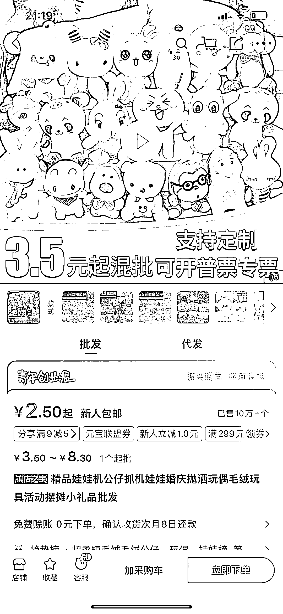

# 新奇摆摊玩法，消费障碍全消除，100% 中奖

> 原文：[`www.yuque.com/for_lazy/xkrm14/uhvkqdsw81w37t95`](https://www.yuque.com/for_lazy/xkrm14/uhvkqdsw81w37t95)

作者： 威曹

日期：2023-06-19

点赞数：73

<ne-hole id="u5822d817" data-lake-id="u5822d817"><ne-card data-card-name="hr" data-card-type="block" id="Y6Dut" data-event-boundary="card">

正文：

摆摊玩法挺新奇 12 元一次，20 元两次 100%中奖消除消费障碍 最差有个小娃娃，最好能中大娃娃 拿捏了用户心理，摆摊也这么卷了

<ne-card data-card-name="image" data-card-type="inline" id="WWdCK" data-event-boundary="card">  <ne-p id="ub41a8dd5" data-lake-id="ub41a8dd5"><ne-card data-card-name="image" data-card-type="inline" id="eBCW7" data-event-boundary="card">  <ne-hole id="ub09de630" data-lake-id="ub09de630"><ne-card data-card-name="hr" data-card-type="block" id="HzChm" data-event-boundary="card"><ne-p id="uede6ddd8" data-lake-id="uede6ddd8">评论区：

贝壳 : 我见过，但生意不怎么样

威曹 : 谢谢老大[呲牙]

<ne-hole id="uf43150cb" data-lake-id="uf43150cb"><ne-card data-card-name="hr" data-card-type="block" id="iWB8s" data-event-boundary="card">

公众号懒人找资源，懒人专属群分享

</ne-card></ne-hole></ne-card></ne-hole></ne-card></ne-p></ne-card></ne-p></ne-card></ne-hole>