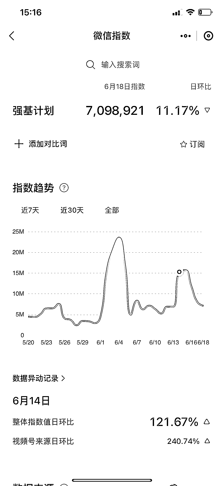

# 备考强基的关键资料引流，往届真题和面试技巧等都有涵盖

> 原文：[`www.yuque.com/for_lazy/xkrm14/uiy7fb013myycieb`](https://www.yuque.com/for_lazy/xkrm14/uiy7fb013myycieb)

作者： 笑笑

日期：2023-06-19

点赞数：56

正文：

对于要参加强基的同学来说，高考还没结束 强基在 7 月初考试，从 20 年开始的一项国家计划，资料信息还不多，可以把往届真题，笔试面试技巧，拆分不同大学不同专业做定向拆解等，做资料引流 能备考强基的人，基本上都是有一些信息源的，还有很多人不知道强基，同时这些人如果能考上强基，直博在大学期间压力不大，大学生副业搞钱他们也会是主流

  

  

评论区：

笑笑 : 感谢亦仁大大

公众号懒人找资源，懒人专属群分享

