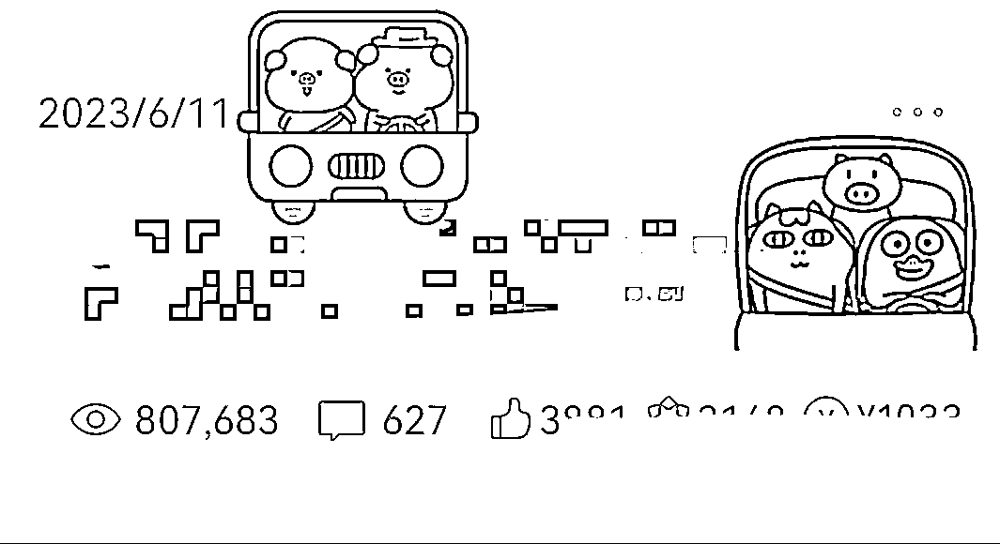
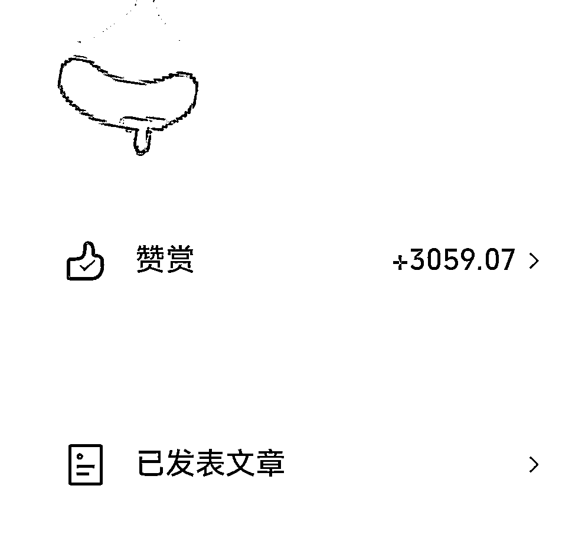

# AI 绘画+ ChatGPT +追热点：12 天收益 39900+，赞赏 3000+

> 原文：[`www.yuque.com/for_lazy/xkrm14/dkiudwwai0wvqod5`](https://www.yuque.com/for_lazy/xkrm14/dkiudwwai0wvqod5)

作者： 小女子💋

日期：2023-06-13

点赞数：214

<ne-hole id="u433d1612" data-lake-id="u433d1612">

正文：

AI 绘画+GPT+追热点发在公众号上，12 天收益 39900+，还有赞赏 3000+，简直不要太香[偷笑]

<ne-hole id="uae8ad8eb" data-lake-id="uae8ad8eb">

评论区：

Ai 申姐全域营销 : 哇塞真厉害，怎么做的，哪个账号，感谢

翱翔蓝天 : 个个都这么厉害👍，什么类型的文章[害羞]

帅子 : 教练威武

小女子💋 : 行规，不暴露账号

小女子💋 : 热点，就这几天的牵手门

Ai 申姐全域营销 : 谢谢

小女子💋 : 帅子也很棒，我在练习发帖，哈哈哈，多尝试一下，感觉生财星球比公众号后台复杂好多

翱翔蓝天 : [强][强][强]

<ne-hole id="ubaef06ac" data-lake-id="ubaef06ac">

公众号懒人找资源，懒人专属群分享

</ne-hole></ne-hole></ne-hole>