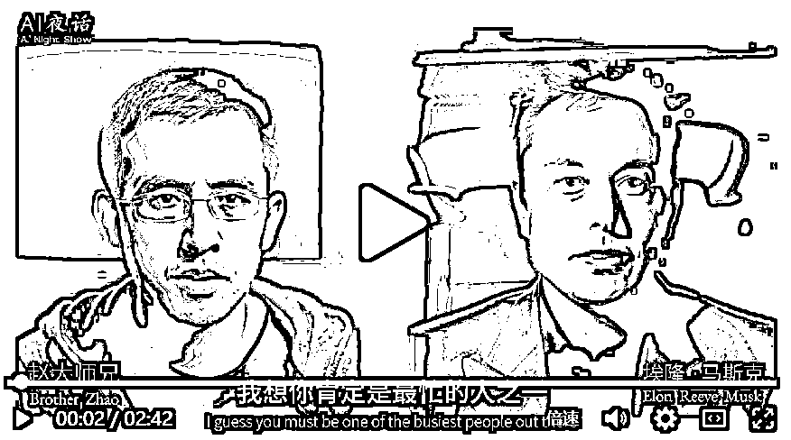
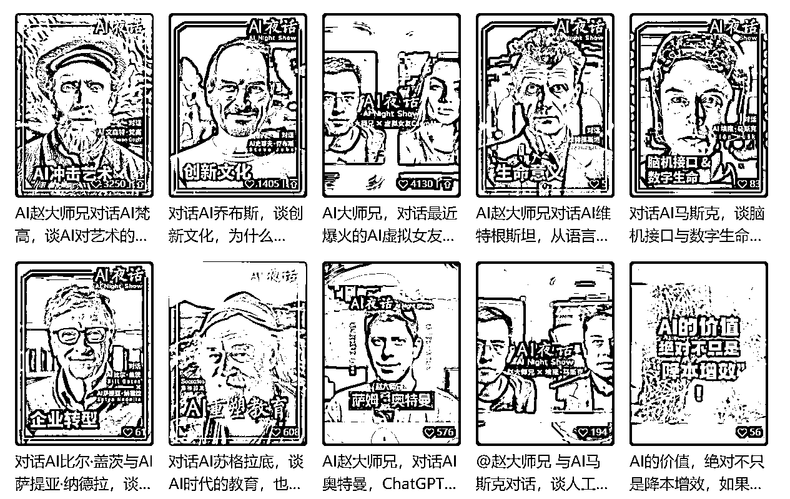

# AI 数字人采访 AI 名人，开启 2.0 时代的视频形式

> 原文：[`www.yuque.com/for_lazy/xkrm14/kseot2d4pra58oeg`](https://www.yuque.com/for_lazy/xkrm14/kseot2d4pra58oeg)

<ne-text id="uaa22a544">作者： 田新一</ne-text>

<ne-text id="u25fc5b6a">日期：2023-06-14</ne-text>

<ne-text id="uf3565a3a">点赞数：</ne-text><ne-text id="u9e366ee5" ne-bold="true">95</ne-text>

<ne-hole id="ua9ed9d36" data-lake-id="ua9ed9d36"><ne-card data-card-name="hr" data-card-type="block" id="LThFj" data-event-boundary="card">

<ne-text id="u4fed5586">正文：</ne-text>

<ne-text id="uf5c3d8b6">发现了一个通过 AI 数字人采访 AI 名人的账号，这个账号目前采访了 9 个 ai 名人，数据都非常好。如果说 ai 小和尚是 ai 视频的 1.0 版本，这个形式的账号已经到了 2.0，并且我们可以通过这个形式做不同领域的账号。</ne-text>

<ne-card data-card-name="image" data-card-type="inline" id="isKs3" data-event-boundary="card">  <ne-p id="ucac15d64" data-lake-id="ucac15d64"><ne-card data-card-name="image" data-card-type="inline" id="il3XT" data-event-boundary="card">  <ne-hole id="u6fe680c2" data-lake-id="u6fe680c2"><ne-card data-card-name="hr" data-card-type="block" id="MSSPP" data-event-boundary="card"><ne-p id="u72ab014d" data-lake-id="u72ab014d"><ne-text id="u52d2eee8">评论区：</ne-text>

<ne-text id="u5ca84c4b">someone so* : 666</ne-text>

<ne-text id="ua8a3fa35">Super 六六 : 有意思，很早有人说这个 ai 模拟对话，没想到有人去做这么多期了</ne-text>

<ne-text id="u2b2de626">大玩家 : 这个好像是哪个网站上的，有很多人的模型，直接对话，刚才还在弄这个网站……</ne-text>

<ne-text id="ubcd17515">田新一 : 嗯，对话不难，账号创意值得学习</ne-text>

<ne-text id="u5b2a0558">小魏从 0 开始做副业 : 这个有链接吗</ne-text>

<ne-text id="u2421d2e6">安然小姐 : 用真人，有没有侵权风险啊？</ne-text>

<ne-text id="u3d786964">来来 : D-ID?</ne-text>

<ne-hole id="ud3cc4d3d" data-lake-id="ud3cc4d3d"><ne-card data-card-name="hr" data-card-type="block" id="QEDWp" data-event-boundary="card">

<ne-text id="u5a58d107">公众号懒人找资源，懒人专属群分享</ne-text>

</ne-card></ne-hole></ne-card></ne-hole></ne-card></ne-p></ne-card></ne-p></ne-card></ne-hole>