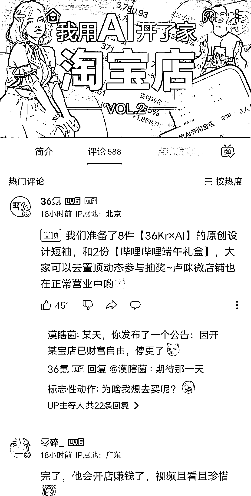

# 三十六、氪 AI 淘宝店一个月卖出 200 件，分享从 0 到 1 的踩坑经验

> 原文：[`www.yuque.com/for_lazy/xkrm14/dhagggn1yke6zgl6`](https://www.yuque.com/for_lazy/xkrm14/dhagggn1yke6zgl6)

作者： 土豆君

日期：2023-06-15

点赞数：75

<ne-hole id="uff64b2c0" data-lake-id="uff64b2c0"><ne-card data-card-name="hr" data-card-type="block" id="p3yla" data-event-boundary="card">

正文：

36 氪 AI 开的淘宝店成真了，一个月卖了快 200 件 一个月前 36 氪开了个 AI 衣服淘宝店，没想到一个月还有后续，他们跑通了 0-1，一个月卖了 200 件，太厉害了，昨天发的视频分享了他们从 0-1 的踩坑经验，可以说是非常实用的教程。 【【36 氪】我用 AI 开的淘宝店成真了，一个月卖了快 200 件！-哔哩哔哩】 【【36 氪】我用 AI 开了家“假”淘宝店，居然真的有人下单？-哔哩哔哩】 [36 氪我用 AI 开的淘宝店成真了一个月卖了快 200 件哔哩哔哩bilibili](https://b23.tv/XAgVYIm) [36 氪我用 AI 开了家假淘宝店居然真的有人下单哔哩哔哩bilibili](https://b23.tv/mKIZnTg)

<ne-card data-card-name="image" data-card-type="inline" id="h6tHm" data-event-boundary="card">  <ne-hole id="u2824f887" data-lake-id="u2824f887"><ne-card data-card-name="hr" data-card-type="block" id="QbJyT" data-event-boundary="card"><ne-p id="u44fb0d45" data-lake-id="u44fb0d45">评论区：

<ne-hole id="u5b61b6b5" data-lake-id="u5b61b6b5"><ne-card data-card-name="hr" data-card-type="block" id="laQ5P" data-event-boundary="card">

公众号懒人找资源，懒人专属群分享

</ne-card></ne-hole></ne-card></ne-hole></ne-card></ne-p></ne-card></ne-hole>