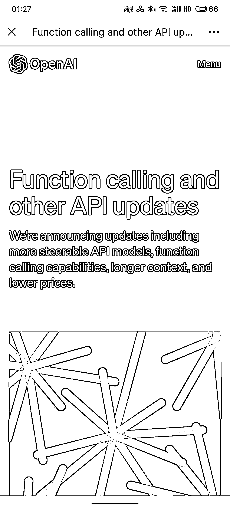

# OpenAI 更新 API 调用模型和功能，价格更低，增加内容限制

> 原文：[`www.yuque.com/for_lazy/xkrm14/ayzmgyabs4pwigxh`](https://www.yuque.com/for_lazy/xkrm14/ayzmgyabs4pwigxh)

<ne-text id="u01164cc4">作者： 石头</ne-text>

<ne-text id="u20f63b92">日期：2023-06-14</ne-text>

<ne-text id="uc7a5add7">点赞数：</ne-text><ne-text id="u52dcd4b3" ne-bold="true">64</ne-text>

<ne-hole id="u710848af" data-lake-id="u710848af"><ne-card data-card-name="hr" data-card-type="block" id="p7Op1" data-event-boundary="card">

<ne-text id="u94148e64">正文：</ne-text>

<ne-text id="ud2c0c7e0">6 月 14 日，openai 最新更新，增加了更多 api 调用模型和功能，增加了 token 内容限制，最重要的价格更低了。 详情见链接:</ne-text> <ne-text id="ub1fe1b79">风向标共创:Aladdin</ne-text>[<ne-text id="u51d3c094">FunctioncallingandotherAPIupdates</ne-text>](https://openai.com/blog/function-calling-and-other-api-updates)

<ne-card data-card-name="image" data-card-type="inline" id="QLMjM" data-event-boundary="card">  <ne-hole id="ub063c33f" data-lake-id="ub063c33f"><ne-card data-card-name="hr" data-card-type="block" id="ItQC4" data-event-boundary="card"><ne-p id="u22db9f68" data-lake-id="u22db9f68"><ne-text id="uc7a61b7e">评论区：</ne-text>

<ne-text id="u1a4b9984">周彦充 : 感觉真棒，</ne-text>

<ne-text id="u7f843616">石头 : 🤝</ne-text>

<ne-hole id="u45170f44" data-lake-id="u45170f44"><ne-card data-card-name="hr" data-card-type="block" id="v8YZe" data-event-boundary="card">

<ne-text id="ub3363ead">公众号懒人找资源，懒人专属群分享</ne-text>

</ne-card></ne-hole></ne-card></ne-hole></ne-card></ne-p></ne-card></ne-hole>