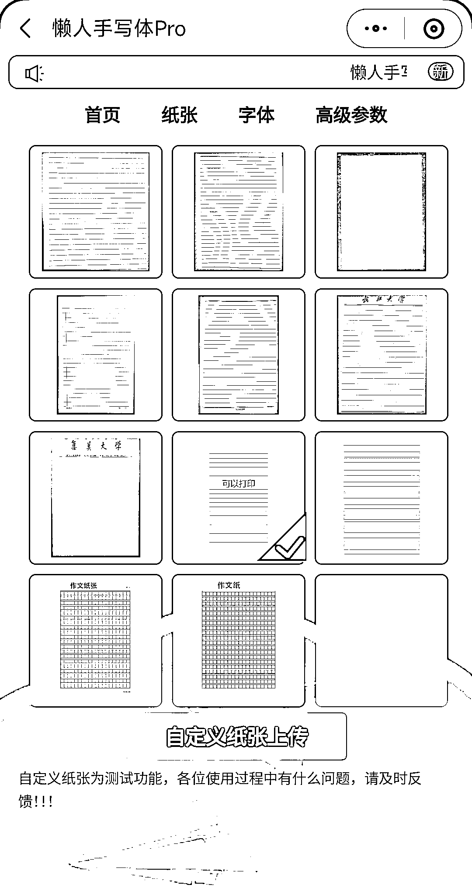

# 手写字直接生成的微信小程序，用起来挺方便

> 原文：[`www.yuque.com/for_lazy/xkrm14/na7wsskdc6yfhuza`](https://www.yuque.com/for_lazy/xkrm14/na7wsskdc6yfhuza)

<ne-text id="u1a3ee50b">作者： 幻景</ne-text>

<ne-text id="ufb45c2b7">日期：2023-06-14</ne-text>

<ne-text id="ub45e0eb9">点赞数：</ne-text><ne-text id="u4af987c2" ne-bold="true">140</ne-text>

<ne-hole id="u397ac4a6" data-lake-id="u397ac4a6"><ne-card data-card-name="hr" data-card-type="block" id="Ca8BG" data-event-boundary="card">

<ne-text id="ub85d8f38">正文：</ne-text>

<ne-text id="u447913dc">手写字直接生成，这样的微信小程序挺方便。 纸张、字体都可以选择，可以设置各种参数。 也可以自定义纸张类型，用起来也挺方便。</ne-text>

<ne-card data-card-name="image" data-card-type="inline" id="wkSsQ" data-event-boundary="card">  <ne-p id="uc0e6c51f" data-lake-id="uc0e6c51f"><ne-card data-card-name="image" data-card-type="inline" id="fWkqj" data-event-boundary="card"></ne-card>

<ne-card data-card-name="image" data-card-type="inline" id="bD3rA" data-event-boundary="card"></ne-card>

<ne-card data-card-name="image" data-card-type="inline" id="EGY0P" data-event-boundary="card"></ne-card>

<ne-card data-card-name="image" data-card-type="inline" id="jbEDE" data-event-boundary="card"></ne-card>

<ne-card data-card-name="image" data-card-type="inline" id="o099h" data-event-boundary="card"></ne-card>

<ne-hole id="ue18f53e0" data-lake-id="ue18f53e0"><ne-card data-card-name="hr" data-card-type="block" id="X1UGL" data-event-boundary="card">

<ne-text id="u12d29e5b">评论区：</ne-text>

<ne-text id="u80cd324e">也许吧 : 集大校友？</ne-text>

<ne-text id="u4d9a8e6d">倪大胖 : 这个赞</ne-text>

<ne-text id="uae120549">倪大胖 : 有很多应用场景</ne-text>

<ne-text id="uc076b783">幻景 : 不是哈，那只是在里面可选的一款纸张</ne-text>

<ne-text id="uae881a9a">Bill 陈 : 校友？</ne-text>

<ne-text id="uf9e26bbc">一直很安静🏇🏾 : 校友啊</ne-text>

<ne-text id="u225b244e">秋林 : 小红书很多手写字体的 小问题 数据都很大</ne-text>

<ne-hole id="uc42f045d" data-lake-id="uc42f045d"><ne-card data-card-name="hr" data-card-type="block" id="xR4iv" data-event-boundary="card">

<ne-text id="u1c007231">公众号懒人找资源，懒人专属群分享</ne-text>

</ne-card></ne-hole></ne-card></ne-hole></ne-card></ne-p></ne-card></ne-hole>