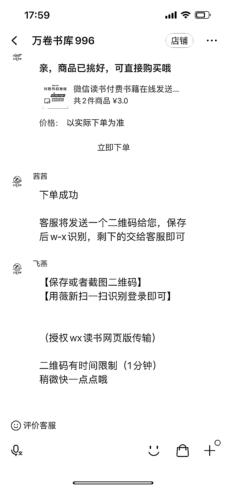

# 微信电子书：3 元一本，月销 1W+

> 原文：[`www.yuque.com/for_lazy/xkrm14/adczz2zqtnc93g2s`](https://www.yuque.com/for_lazy/xkrm14/adczz2zqtnc93g2s)

<ne-text id="u1e73d9f6">作者： Zeng Gong</ne-text>

<ne-text id="u7755ff35">日期：2023-06-15</ne-text>

<ne-text id="ue02b95f5">点赞数：</ne-text><ne-text id="u8853795c" ne-bold="true">110</ne-text>

<ne-hole id="ua08bd382" data-lake-id="ua08bd382"><ne-card data-card-name="hr" data-card-type="block" id="hTLvq" data-event-boundary="card">

<ne-text id="u1e49cbb6">正文：</ne-text>

<ne-text id="uedf6cf5e">微信电子书，通过二维码导入到微信读书，一本 3 块钱，一个月销量 1 万+。</ne-text>

<ne-card data-card-name="image" data-card-type="inline" id="kSMNk" data-event-boundary="card"></ne-card>

<ne-card data-card-name="image" data-card-type="inline" id="kWq3Y" data-event-boundary="card"></ne-card>

<ne-hole id="uf0dc1e63" data-lake-id="uf0dc1e63"><ne-card data-card-name="hr" data-card-type="block" id="PY5yt" data-event-boundary="card">

<ne-text id="uf59134eb">评论区：</ne-text>

<ne-text id="u4ee66e10">白宝香 : 还能这样，好奇怎么做到的</ne-text>

<ne-text id="uad7a6153">白宝香 : 为了省事 自己开了个年会员</ne-text>

<ne-text id="u54941cb8">Zeng Gong : 原理是很简单，跟微信读书本地导入 PDF 或其他电子书是一样的。只能阅读，看不到评论。 具体怎么做到远程导入就是技术活了[捂脸]</ne-text>

<ne-text id="u21d9a48a">白宝香 : 好的谢谢</ne-text>

<ne-text id="udbd5d8a1">威曹 : 用网页版微信读书，扫码就是为了在网页端登录，直接文件拖进去就可以了。</ne-text>

<ne-text id="ud7cd3f01">Zeng Gong : 这样的😀明天试一下</ne-text>

<ne-text id="u8662f8c8">Zeng Gong : 😀谢谢亦仁老大，开心～</ne-text>

<ne-hole id="u21e7fc98" data-lake-id="u21e7fc98"><ne-card data-card-name="hr" data-card-type="block" id="bGL4h" data-event-boundary="card">

<ne-text id="uf7a99997">公众号懒人找资源，懒人专属群分享</ne-text>

</ne-card></ne-hole></ne-card></ne-hole></ne-card></ne-hole>