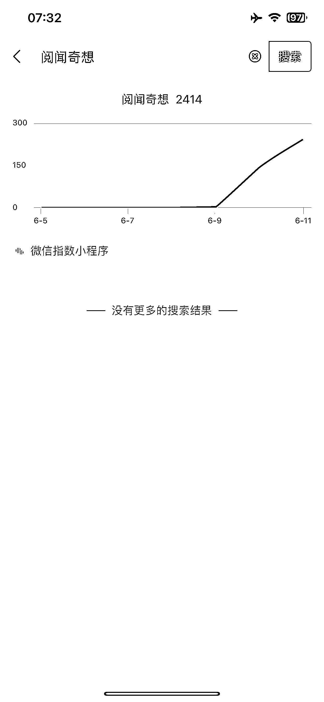

# 微信问一问成为流量风口，回答好问题轻松涨粉

> 原文：[`www.yuque.com/for_lazy/xkrm14/dpb7p13stm21ikpd`](https://www.yuque.com/for_lazy/xkrm14/dpb7p13stm21ikpd)

<ne-p id="u03f80beb" data-lake-id="u03f80beb"><ne-text id="ubd5f0429">作者： 致远必胜</ne-text></ne-p> <ne-p id="ube03dca2" data-lake-id="ube03dca2"><ne-text id="u465b323d">日期：2023-06-12</ne-text></ne-p> <ne-p id="u3dc93b18" data-lake-id="u3dc93b18"><ne-text id="ue3204b06">点赞数：</ne-text><ne-text id="u72121d6c" ne-bold="true">96</ne-text></ne-p> <ne-hole id="ud8648e56" data-lake-id="ud8648e56"><ne-card data-card-name="hr" data-card-type="block" id="CYgiH" data-event-boundary="card"><ne-p id="u49514bad" data-lake-id="u49514bad"><ne-text id="ucce462b4">正文：</ne-text></ne-p> <ne-p id="ua4164977" data-lake-id="ua4164977"><ne-text id="u8d7fa85c">问一问回得好，粉丝涨着跑！微信问一问，一定要重视起来。这个现在是流量风口，只要你回答的问题 OK，涨粉一点都不难。</ne-text> <ne-text id="u8185b051">另，视频号得先有。目前测试下来的结果是，在问一问上面给你点赞的用户，大概率会去关注你的视频号（得有内容）</ne-text> <ne-text id="u22d42962">有了粉丝关注，再引流到私域里面，就是顺理成章的事了。 引流还难吗？ 另，还能提升微信搜索指数，不到一天时间，我的指数涨了 1000</ne-text></ne-p> <ne-p id="u5c7b209a" data-lake-id="u5c7b209a"><ne-card data-card-name="image" data-card-type="inline" id="GyqQt" data-event-boundary="card">  <ne-p id="uc8291eb9" data-lake-id="uc8291eb9"><ne-card data-card-name="image" data-card-type="inline" id="EL323" data-event-boundary="card">  <ne-p id="u8d0868bd" data-lake-id="u8d0868bd"><ne-card data-card-name="image" data-card-type="inline" id="pzCYA" data-event-boundary="card">  <ne-hole id="u88d56d79" data-lake-id="u88d56d79"><ne-card data-card-name="hr" data-card-type="block" id="y9ujm" data-event-boundary="card"><ne-p id="u3f0e0487" data-lake-id="u3f0e0487"><ne-text id="ue36b496d">评论区：</ne-text></ne-p> <ne-p id="uda6bb37c" data-lake-id="uda6bb37c"><ne-text id="u8651d888">致远必胜 : 感谢亦仁大大让我上了一次“头条”[呲牙][呲牙]</ne-text></ne-p> <ne-p id="u98bceaa1" data-lake-id="u98bceaa1"><ne-text id="ue4408947">久违 : 如何开通问一问？</ne-text></ne-p> <ne-p id="ud212aa49" data-lake-id="ud212aa49"><ne-text id="ud1aa2bb7">Dream : 开通视频号就有了</ne-text></ne-p> <ne-p id="uefdf576d" data-lake-id="uefdf576d"><ne-text id="ub84a3388">shijinzhan : 感谢分享，我昨天回答了 2 个问题，涨了 1 个粉，关键是我视频号没啥内容[偷笑]</ne-text></ne-p> <ne-p id="u5bcc6127" data-lake-id="u5bcc6127"><ne-text id="uf88c4283">致远必胜 : 哈哈，可以的</ne-text></ne-p> <ne-p id="ubfda3be6" data-lake-id="ubfda3be6"><ne-text id="u0b9fd367">致远必胜 : 去回答问题就有了</ne-text></ne-p> <ne-p id="uba1b9671" data-lake-id="uba1b9671"><ne-text id="ud08c56d7">贝壳 : 我今天去试了一下，回答了 20 多个问题。涨了 7 个视频号的粉丝。</ne-text></ne-p> <ne-hole id="u48c98533" data-lake-id="u48c98533"><ne-card data-card-name="hr" data-card-type="block" id="rs05t" data-event-boundary="card"><ne-p id="u55ffe41b" data-lake-id="u55ffe41b"><ne-text id="u3ac63bbb">公众号懒人找资源，懒人专属群分享</ne-text></ne-p></ne-card></ne-hole></ne-card></ne-hole></ne-card></ne-p></ne-card></ne-p></ne-card></ne-p></ne-card></ne-hole>