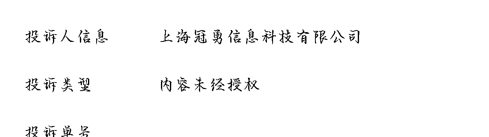

# 公众号创作者要注意，避免侵权造成损失

> 原文：[`www.yuque.com/for_lazy/xkrm14/bmxrdod2y56gmgof`](https://www.yuque.com/for_lazy/xkrm14/bmxrdod2y56gmgof)

作者： 随想

日期：2023-06-15

点赞数：90

<ne-hole id="ufebe07c3" data-lake-id="ufebe07c3"><ne-card data-card-name="hr" data-card-type="block" id="cmUSm" data-event-boundary="card">

正文：

做公众号的要注意了，避免损失 最近圈里 公众号创作开始热起来了，有不少童鞋赚了钱。 在这里也给大家提个醒：千万要注意，如果要开通流量主，尽量原创！！有一堆如下公司在等着！ 我的一篇网络整理帖子【牵手们的，不到 1 千字】，未认证的账号，只有 2000+多浏览量，也被这种种公司盯上了：要帮他人投诉侵权[捂脸][捂脸]。莫名其妙！！！ 这家公司，吃相非常很难看！

<ne-card data-card-name="image" data-card-type="inline" id="xSii4" data-event-boundary="card">  <ne-hole id="uc703b8ee" data-lake-id="uc703b8ee"><ne-card data-card-name="hr" data-card-type="block" id="bVFyL" data-event-boundary="card"><ne-p id="uf9c9f23a" data-lake-id="uf9c9f23a">评论区：

大熊 : 有一堆人专门做这个

随想 : 我今天也开眼了：头条公开的文章，关于热点新闻的，也会啥版权的说法。微信还不让申诉，无语。

大熊 : 你是头条被投诉的吗

随想 : 不是，头条的文章，整理转发到微信公众号。上面那个第三方公司，微信订阅号投诉。

胖大魔 : GPT 改一下[呲牙]

胖大魔 : 集成在一个帖子，只标记链接不影响吧。不然我就开始洗稿或者约人重新

随想 : 集成的，不到 1200 字，没法插 2 条文中广告。900 字，插一条文中广告。只能洗稿。不过对于热点事件，图片太多，分段太多，洗稿效率不高

<ne-hole id="uef89c4ab" data-lake-id="uef89c4ab"><ne-card data-card-name="hr" data-card-type="block" id="hp1gT" data-event-boundary="card">

公众号懒人找资源，懒人专属群分享

</ne-card></ne-hole></ne-card></ne-hole></ne-card></ne-p></ne-card></ne-hole>