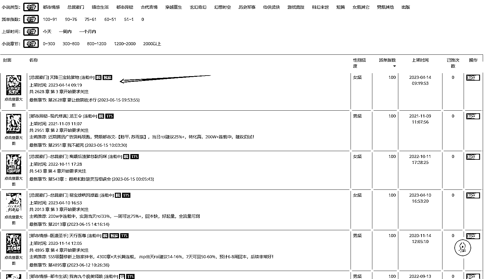
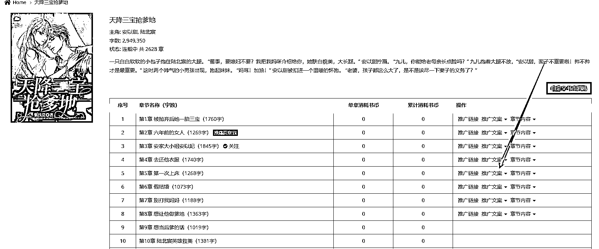

# 利用 Chat GPT 结合当前热点进行公众号小说推广，赚取广告和充值返佣

> 原文：[`www.yuque.com/for_lazy/xkrm14/ag3g5dybtxbztwx7`](https://www.yuque.com/for_lazy/xkrm14/ag3g5dybtxbztwx7)

<ne-text id="u00dce474">作者： 晨哥</ne-text>

<ne-text id="u4fd15efd">日期：2023-06-15</ne-text>

<ne-text id="ua64ee1ee">点赞数：</ne-text><ne-text id="uc74961e0" ne-bold="true">87</ne-text>

<ne-hole id="u46b8838a" data-lake-id="u46b8838a"><ne-card data-card-name="hr" data-card-type="block" id="yCIKs" data-event-boundary="card">

<ne-text id="u2f6fa4a4">正文：</ne-text>

<ne-text id="u31070794">公众号小说推广结合 chat GPT 是个不错的选择如下：首先公众号绑定小说分销平台，利用 chat GPT</ne-text> <ne-text id="ue71677f7">把小说文案结合当前热点，进行二次原创，小说文案的图片也用 chatGTP 生成，生成和小说内容相关的图片，吸引人的欲望，让他们点进去，点进去以后，前期免费看 3-8 个章节在看的话需要充值，我们的收益来源：</ne-text> <ne-text id="u1169ffc2">1.公众号挂广告。2.小说充值的返佣，一般在 75%以上。客户冲 100 你拿 75， 3.自己开店挂商品</ne-text> <ne-text id="ue021b323">这是我目前想到的，公众号小说项目 16 年就有，我是 17 年做了一年闲置到现在，我看他文章很多人利用 chat</ne-text> <ne-text id="u7eb31a51">gpt 进行洗稿二次发布赚了很多，所以我就重新思考这个公众号小说推文了</ne-text>

<ne-card data-card-name="image" data-card-type="inline" id="v9wB0" data-event-boundary="card">  <ne-p id="u3d2834fa" data-lake-id="u3d2834fa"><ne-card data-card-name="image" data-card-type="inline" id="tpA9e" data-event-boundary="card">  <ne-hole id="u372abfd3" data-lake-id="u372abfd3"><ne-card data-card-name="hr" data-card-type="block" id="M16sm" data-event-boundary="card"><ne-p id="u04a52aef" data-lake-id="u04a52aef"><ne-text id="u951bb4ca">评论区：</ne-text>

<ne-text id="uebb4298e">随想 : 这是啥小说平台？没有小说粉丝的话，平台会给推送么？</ne-text>

<ne-text id="u66b36413">晨哥 : 我们搭建公众号，对接小说分发平台，用户充值我们按比例分佣，至于粉丝，这个可以把文章结合热点二次宣传，只要文章爆了，就有收益</ne-text>

<ne-text id="u5d5e1136">晨哥 : 再次思考🤔，把小说内容以讲故事的形式呈现出来，是否可以吸引一波流量，粉丝多了，接广告表现</ne-text>

<ne-text id="u20689e5d">雅士哥哥 : 我现有公众号小说粉 可合作</ne-text>

<ne-text id="ua7135c83">晨哥 : 那就用公众号直接推就可以了</ne-text>

<ne-text id="udd43274d">米斯特 LIu : 小说平台如何对接公众号呢？</ne-text>

<ne-text id="u4a5e631c">晓光 : 有对标账号吗？</ne-text>

<ne-text id="uc93c8088">晨哥 : 这个直接搜带小说的公众号</ne-text>

<ne-hole id="ub7d42aa3" data-lake-id="ub7d42aa3"><ne-card data-card-name="hr" data-card-type="block" id="ZR7ye" data-event-boundary="card">

<ne-text id="u62cad4a2">公众号懒人找资源，懒人专属群分享</ne-text>

</ne-card></ne-hole></ne-card></ne-hole></ne-card></ne-p></ne-card></ne-p></ne-card></ne-hole>