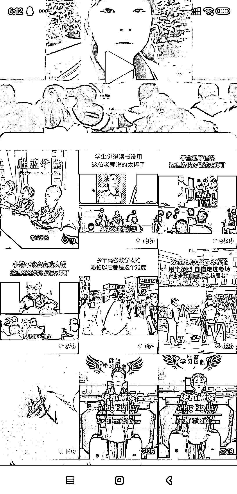

# 如何在视频号上吸引家长关注，卖课赚钱

> 原文：[`www.yuque.com/for_lazy/xkrm14/da2psyar47r6lgrl`](https://www.yuque.com/for_lazy/xkrm14/da2psyar47r6lgrl)

作者： Nia

日期：2023-06-14

点赞数：79

正文：

视频号上的小学生家长这块，这种内容表现形式的流量很好，图一乍一看好像在教室里，实际上只需要一个背景加上一个视频，内容制作也简单，家长看到却会停留，可以发各种语录类内容。 图二是账号之前的实拍视频内容，流量明显没有这类课堂视频高。这类人群可以卖课，像图三是其他账号在卖的，卖亲子沟通课，家庭教育课等等，单价 19.9-399，或者卖其他学科类的课程也可以吧，甚至引流到私域还可以卖书包文具等

评论区：

公众号懒人找资源，懒人专属群分享

