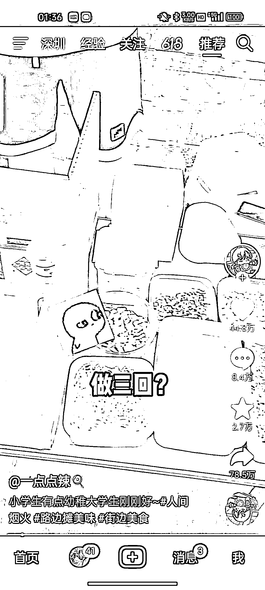

# DIY 迷你小厨房火爆，两天十万评论，15 元体验 3 道菜

> 原文：[`www.yuque.com/for_lazy/xkrm14/ws0ghpu2yg15dln5`](https://www.yuque.com/for_lazy/xkrm14/ws0ghpu2yg15dln5)

<ne-text id="u55e6e0d6">作者： 西米</ne-text>

<ne-text id="uf5b00a85">日期：2023-06-12</ne-text>

<ne-text id="ued345134">点赞数：</ne-text><ne-text id="ued668d9b" ne-bold="true">90</ne-text>

<ne-hole id="uf425d2f7" data-lake-id="uf425d2f7"><ne-card data-card-name="hr" data-card-type="block" id="zyoO8" data-event-boundary="card">

<ne-text id="uab3ff910">正文：</ne-text>

<ne-text id="uad3a03c6">自己动手的迷你小厨房，两天十万评论，十五块钱玩 3 回，做三个菜 自己做，准备几套小工具，找个人流多的年轻的场地，不做也可以卖工具</ne-text>

<ne-card data-card-name="image" data-card-type="inline" id="lh3JF" data-event-boundary="card"></ne-card>

<ne-card data-card-name="image" data-card-type="inline" id="kKa2d" data-event-boundary="card"></ne-card>

<ne-card data-card-name="image" data-card-type="inline" id="BpVq4" data-event-boundary="card"></ne-card>

<ne-hole id="ub8575119" data-lake-id="ub8575119"><ne-card data-card-name="hr" data-card-type="block" id="WV92Z" data-event-boundary="card">

<ne-text id="uff95d448">评论区：</ne-text>

<ne-text id="uab8d34a5">歧黄之后 : 刚刷到这个想发，发现你发过了[呲牙]</ne-text>

<ne-text id="u29ce5794">加英 : 我想做这个，没搜到有人已经在执行了</ne-text>

<ne-text id="u09a515c2">未见青山 : 风向标看到就要发，不然就会有和你一样有眼光的人[流泪]</ne-text>

<ne-text id="u03497508">蒋小葆 : 卖过这款迷你小厨房</ne-text>

<ne-hole id="ub3034b9b" data-lake-id="ub3034b9b"><ne-card data-card-name="hr" data-card-type="block" id="XaJHU" data-event-boundary="card">

<ne-text id="u6f78f0d1">公众号懒人找资源，懒人专属群分享</ne-text>

</ne-card></ne-hole></ne-card></ne-hole></ne-card></ne-hole>