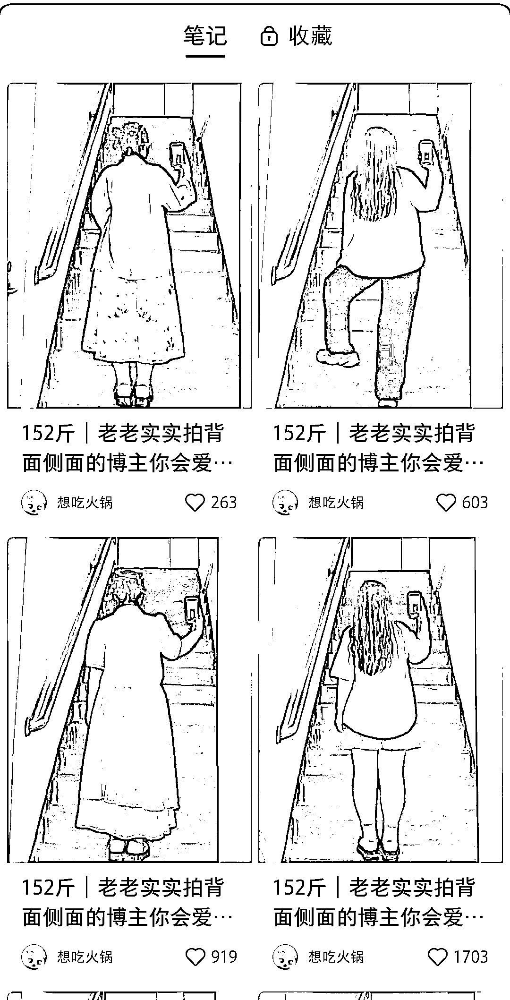
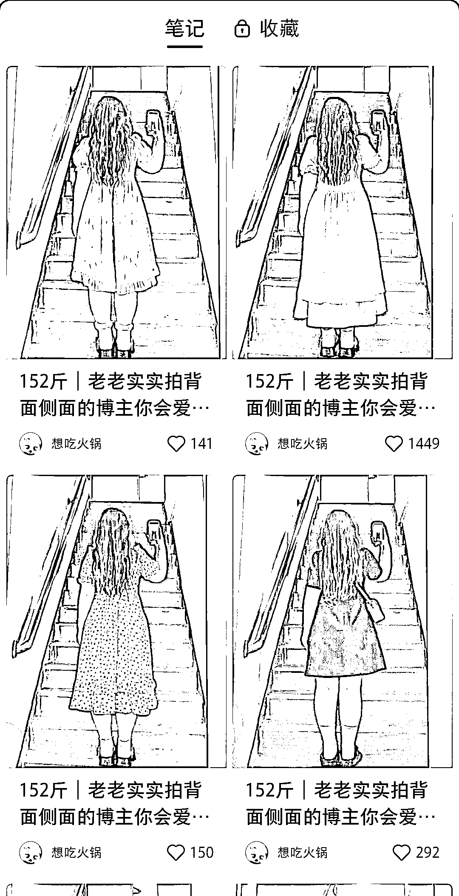

# 小红书穿搭账号差异化做得非常好，账号数据不错

> 原文：[`www.yuque.com/for_lazy/xkrm14/zqig7v8ygr30diil`](https://www.yuque.com/for_lazy/xkrm14/zqig7v8ygr30diil)

<ne-p id="u79e376d4" data-lake-id="u79e376d4"><ne-text id="u0048a602">作者： hedy</ne-text></ne-p> <ne-p id="u83a8d921" data-lake-id="u83a8d921"><ne-text id="u746a7456">日期：2023-06-15</ne-text></ne-p> <ne-p id="ud7280ac0" data-lake-id="ud7280ac0"><ne-text id="u67951e72">点赞数：</ne-text><ne-text id="uecc27b07" ne-bold="true">84</ne-text></ne-p> <ne-hole id="ubff79345" data-lake-id="ubff79345"><ne-card data-card-name="hr" data-card-type="block" id="b6R90" data-event-boundary="card"><ne-p id="ueda9225a" data-lake-id="ueda9225a"><ne-text id="u6b8e7772">正文：</ne-text></ne-p> <ne-p id="uadc9a095" data-lake-id="uadc9a095"><ne-text id="ucb766d01">小红书上看到一个穿搭账号，差异化做得非常好～</ne-text> <ne-text id="u2f412200">跟清一流的露正面，肤白貌美细长腿的穿搭完全不同，这个博主本身偏胖，巧妙地避开正面，而是从背面和侧面这两个角度去分享穿搭，账号封面也很统一，标题也不变，公式就是：多少斤+老老实实拍侧面背面的博主你会爱吗？</ne-text> <ne-text id="u3d6911b5">账号数据很不错，这个在差异化思路及账号风格非常值得借鉴</ne-text></ne-p> <ne-p id="ueafada49" data-lake-id="ueafada49"><ne-card data-card-name="image" data-card-type="inline" id="xnQCD" data-event-boundary="card"></ne-card></ne-p> <ne-p id="u06811cd8" data-lake-id="u06811cd8"><ne-card data-card-name="image" data-card-type="inline" id="zrjgS" data-event-boundary="card"></ne-card></ne-p> <ne-hole id="u409a53bb" data-lake-id="u409a53bb"><ne-card data-card-name="hr" data-card-type="block" id="SAVO4" data-event-boundary="card"><ne-p id="u30a55765" data-lake-id="u30a55765"><ne-text id="u30c5dcca">评论区：</ne-text></ne-p> <ne-p id="ue7abe986" data-lake-id="ue7abe986"><ne-text id="u95e6e011">胖大魔 : 什么叫专业</ne-text></ne-p> <ne-p id="u5fa5aa75" data-lake-id="u5fa5aa75"><ne-text id="ua86a92b2">陈真 : 打响了小红书差异化运行的第一枪，同时也标志着，小红书竞争越来越激烈，不知道我这样理解可以吗？ 她的这种差异化，拿到其他平台也是可以的，但要看具体的效果。</ne-text> <ne-text id="u5f09d26a">那最直接的就是复制，加少量的创新，高个子的，男的，小孩的。 由于我的见识限制了我的想象力，只能看到这些。</ne-text></ne-p> <ne-hole id="u6f5885d0" data-lake-id="u6f5885d0"><ne-card data-card-name="hr" data-card-type="block" id="psi7w" data-event-boundary="card"><ne-p id="u112afa7b" data-lake-id="u112afa7b"><ne-text id="uf90870b3">公众号懒人找资源，懒人专属群分享</ne-text></ne-p></ne-card></ne-hole></ne-card></ne-hole></ne-card></ne-hole>