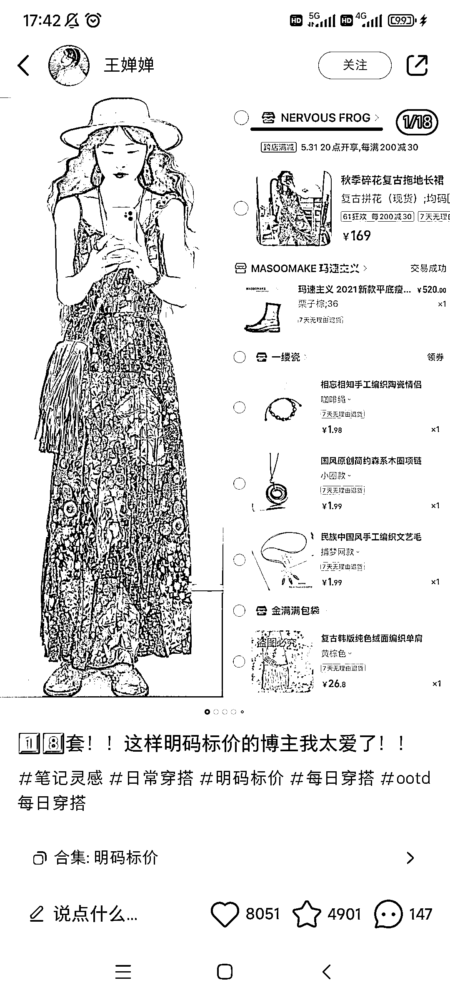

# 小红书穿搭带货模板，有效避免淘宝店铺封禁

> 原文：[`www.yuque.com/for_lazy/xkrm14/tg4dc6iebck6l6wl`](https://www.yuque.com/for_lazy/xkrm14/tg4dc6iebck6l6wl)

<ne-p id="u4eea7a88" data-lake-id="u4eea7a88"><ne-text id="u59acc736">作者： 阿黎</ne-text></ne-p> <ne-p id="u8fb64160" data-lake-id="u8fb64160"><ne-text id="ud0fb090e">日期：2023-06-13</ne-text></ne-p> <ne-p id="uc00d905b" data-lake-id="uc00d905b"><ne-text id="u06f81bbd">点赞数：</ne-text><ne-text id="u4b0f69ea" ne-bold="true">80</ne-text></ne-p> <ne-hole id="u5c76b4a2" data-lake-id="u5c76b4a2"><ne-card data-card-name="hr" data-card-type="block" id="VKEpH" data-event-boundary="card"><ne-p id="u65038651" data-lake-id="u65038651"><ne-text id="u3bd79368">正文：</ne-text></ne-p> <ne-p id="ube4f3d8a" data-lake-id="ube4f3d8a"><ne-text id="ua64c6989">小红书穿搭热门模板 这位博主的穿搭带货模板，还能给淘宝店铺引流不被封，可以借鉴</ne-text></ne-p> <ne-p id="u19922d9f" data-lake-id="u19922d9f"><ne-card data-card-name="image" data-card-type="inline" id="mVWJ8" data-event-boundary="card"></ne-card></ne-p> <ne-p id="u33f32756" data-lake-id="u33f32756"><ne-card data-card-name="image" data-card-type="inline" id="ekO9L" data-event-boundary="card"></ne-card></ne-p> <ne-p id="ua3b03015" data-lake-id="ua3b03015"><ne-card data-card-name="image" data-card-type="inline" id="YVaix" data-event-boundary="card"></ne-card></ne-p> <ne-p id="u4c7e0652" data-lake-id="u4c7e0652"><ne-card data-card-name="image" data-card-type="inline" id="Bg6xk" data-event-boundary="card"></ne-card></ne-p> <ne-hole id="u3690894d" data-lake-id="u3690894d"><ne-card data-card-name="hr" data-card-type="block" id="V0W8s" data-event-boundary="card"><ne-p id="ubf943cb0" data-lake-id="ubf943cb0"><ne-text id="u3e8f1842">评论区：</ne-text></ne-p> <ne-p id="u9a623ebe" data-lake-id="u9a623ebe"><ne-text id="ud9b7bf56">爱拼才会赢 : 这个素材是直接从淘宝拿吗，还是需要自己穿</ne-text></ne-p> <ne-p id="ub5d4b35d" data-lake-id="ub5d4b35d"><ne-text id="u945ba7b4">阿黎 : 博主是自己穿了拍的</ne-text></ne-p> <ne-p id="u60acfc1f" data-lake-id="u60acfc1f"><ne-text id="uebcd17df">阿甘 : 请问：为什么这样不会被封？</ne-text></ne-p> <ne-p id="ub219e107" data-lake-id="ub219e107"><ne-text id="u3d34f308">阿黎 : 因为平台还没发现，这正是风向标的意义所在，一个机会，冲</ne-text></ne-p> <ne-p id="u09aaf6e9" data-lake-id="u09aaf6e9"><ne-text id="ud9d72d4f">小谢先生 : 想问下直接在小红书店铺卖不可以吗，素材模板也用小红书的</ne-text></ne-p> <ne-p id="uc4f1994a" data-lake-id="uc4f1994a"><ne-text id="uc7ac98c9">阿黎 : 可以的哈，那更好了，看看小红书大航海，有很多可以借鉴</ne-text></ne-p> <ne-p id="u0d40c58e" data-lake-id="u0d40c58e"><ne-text id="ue9ce1105">星空 : 确实可以借鉴耶，</ne-text></ne-p> <ne-hole id="u409f64ab" data-lake-id="u409f64ab"><ne-card data-card-name="hr" data-card-type="block" id="qr3wx" data-event-boundary="card"><ne-p id="uf7136101" data-lake-id="uf7136101"><ne-text id="u08fe0724">公众号懒人找资源，懒人专属群分享</ne-text></ne-p></ne-card></ne-hole></ne-card></ne-hole></ne-card></ne-hole>