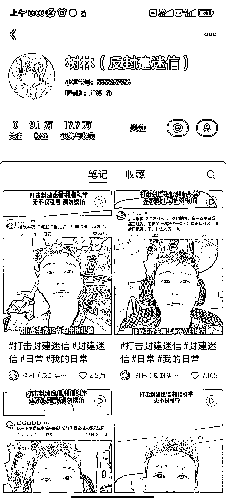

# 十、天内涨粉 9.7w，接着开始接广带货变现

> 原文：[`www.yuque.com/for_lazy/xkrm14/runrmmpol1lc8bhc`](https://www.yuque.com/for_lazy/xkrm14/runrmmpol1lc8bhc)

<ne-text id="u09a0718c">作者： 小橘子</ne-text>

<ne-text id="u377bdacc">日期：2023-06-15</ne-text>

<ne-text id="ue87903e8">点赞数：</ne-text><ne-text id="u228c45ca" ne-bold="true">64</ne-text>

<ne-hole id="u4cae6759" data-lake-id="u4cae6759"><ne-card data-card-name="hr" data-card-type="block" id="sE6x2" data-event-boundary="card">

<ne-text id="u5500b9dd">正文：</ne-text>

<ne-text id="u510a3b3a">月初起号，10 天涨粉 9.7w 然后就可以开始接广，带货变现了</ne-text>

<ne-card data-card-name="image" data-card-type="inline" id="RaBRF" data-event-boundary="card"></ne-card>

<ne-hole id="ub93cea77" data-lake-id="ub93cea77"><ne-card data-card-name="hr" data-card-type="block" id="lRSAw" data-event-boundary="card">

<ne-text id="ua15ed9af">评论区：</ne-text>

<ne-text id="u41bdea3b">melisa : 这人早晚要出事</ne-text>

<ne-text id="u5cc21e52">南意 : 图二的那个吃白饭的当年天涯的大神左央也做过这个实验</ne-text>

<ne-text id="u903b794a">倪大胖 : 有点吓人哈哈</ne-text>

<ne-text id="u25d37755">8 号线 G 先生 : 可以不相信，不过需要敬畏吧</ne-text>

<ne-text id="u251028f7">yetu 耳 : 做这个留意印堂[流汗]</ne-text>

<ne-text id="u13e2fe33">在路上 : 害怕吗</ne-text>

<ne-text id="u479a4454">蓝大虎 : 看到过，太吓人了。</ne-text>

<ne-hole id="uffa94f06" data-lake-id="uffa94f06"><ne-card data-card-name="hr" data-card-type="block" id="cdPSV" data-event-boundary="card">

<ne-text id="u6d86eb4f">公众号懒人找资源，懒人专属群分享</ne-text>

</ne-card></ne-hole></ne-card></ne-hole></ne-card></ne-hole>