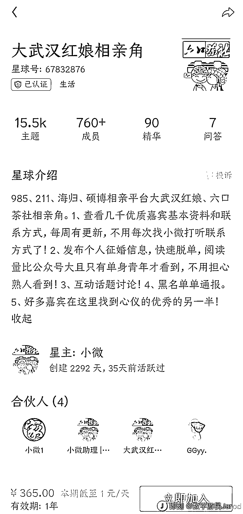

# 知识星球成为相亲新热点，需求旺盛

> 原文：[`www.yuque.com/for_lazy/xkrm14/xu7a03mmse8yfx6g`](https://www.yuque.com/for_lazy/xkrm14/xu7a03mmse8yfx6g)

<ne-text id="u2b000968">作者： 清梦</ne-text>

<ne-text id="u29060a75">日期：2023-06-12</ne-text>

<ne-text id="ucccc766a">点赞数：</ne-text><ne-text id="u9bfbfd73" ne-bold="true">133</ne-text>

<ne-hole id="uada55f83" data-lake-id="uada55f83"><ne-card data-card-name="hr" data-card-type="block" id="ISN7w" data-event-boundary="card">

<ne-text id="u0d416792">正文：</ne-text>

<ne-text id="uf3558a05">相亲在知识星球做起来了 需求还挺强烈的[憨笑]</ne-text>

<ne-card data-card-name="image" data-card-type="inline" id="cMUwD" data-event-boundary="card"></ne-card>

<ne-card data-card-name="image" data-card-type="inline" id="iRUZm" data-event-boundary="card"></ne-card>

<ne-card data-card-name="image" data-card-type="inline" id="y7m5v" data-event-boundary="card"></ne-card>

<ne-hole id="u3bfe7a6b" data-lake-id="u3bfe7a6b"><ne-card data-card-name="hr" data-card-type="block" id="XTh2E" data-event-boundary="card">

<ne-text id="u803f540f">评论区：</ne-text>

<ne-text id="u9a6074bb">周彦充 : 真会玩，哈哈</ne-text>

<ne-text id="u125f8c0d">Ashley : 这种是直接建立星球吗？前期有沉淀用户吗？</ne-text>

<ne-text id="uaabc3666">SYH : 有北京的相亲角吗？</ne-text>

<ne-text id="u618fdd16">胖大魔 : 我不配[呲牙]</ne-text>

<ne-text id="u48ced323">万青 : 之前看见个类似 app 也是做高学历相亲的</ne-text>

<ne-text id="u9cd56e06">叉叉敌 : 成都人民公园有好多这样的素材呀</ne-text>

<ne-text id="u0d1e00b3">从前有座山 : 学习下能快速复制不[得意]</ne-text>

<ne-hole id="ue76012aa" data-lake-id="ue76012aa"><ne-card data-card-name="hr" data-card-type="block" id="ieKGN" data-event-boundary="card">

<ne-text id="u3cf87d7c">公众号懒人找资源，懒人专属群分享</ne-text>

</ne-card></ne-hole></ne-card></ne-hole></ne-card></ne-hole>