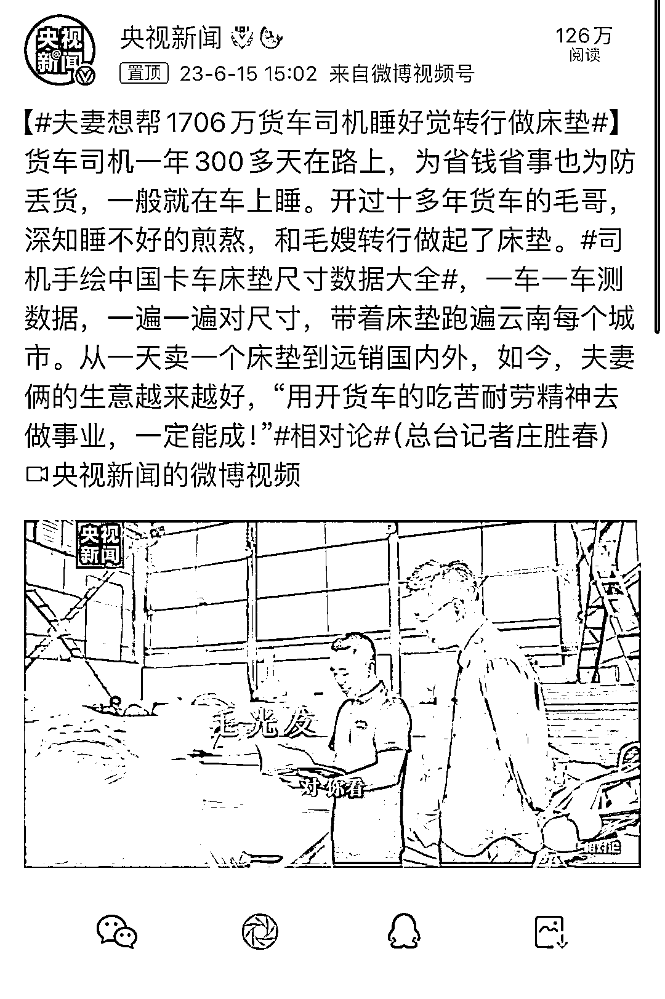

# 折叠改造：将痛点转化为商机，解决尺寸适配问题

> 原文：[`www.yuque.com/for_lazy/xkrm14/ddsch1e5cveyixga`](https://www.yuque.com/for_lazy/xkrm14/ddsch1e5cveyixga)

<ne-text id="u8b1b052a">作者： 篝火</ne-text>

<ne-text id="uab2947da">日期：2023-06-15</ne-text>

<ne-text id="u71611fc8">点赞数：</ne-text><ne-text id="u810c0eb4" ne-bold="true">77</ne-text>

<ne-hole id="u77139738" data-lake-id="u77139738"><ne-card data-card-name="hr" data-card-type="block" id="N0axV" data-event-boundary="card">

<ne-text id="u6f881ed2">正文：</ne-text>

<ne-text id="ua495e8a4">痛点变成商机，折叠改造可以解决尺寸适配问题</ne-text>

<ne-card data-card-name="image" data-card-type="inline" id="JNHvu" data-event-boundary="card"></ne-card>

<ne-hole id="u83959965" data-lake-id="u83959965"><ne-card data-card-name="hr" data-card-type="block" id="bQVci" data-event-boundary="card">

<ne-text id="ufd29162f">评论区：</ne-text>

<ne-text id="ucc7774ad">素练 : 真的是，痛点就是声音</ne-text>

<ne-text id="u2fc5dfc9">飞掌柜 : 这个太厉害了</ne-text>

<ne-text id="uaf50700c">何明峰 : B 站之前的一个纪录片《这货哪来的》介绍过</ne-text>

<ne-text id="u2cbf14c3">阿杜 : 有时候痛点就是商机</ne-text>

<ne-text id="u1fcf8b02">黄林风 : 不淘金，卖铲子</ne-text>

<ne-hole id="ubd788f65" data-lake-id="ubd788f65"><ne-card data-card-name="hr" data-card-type="block" id="tadcg" data-event-boundary="card">

<ne-text id="u8d4310c0">公众号懒人找资源，懒人专属群分享</ne-text>

</ne-card></ne-hole></ne-card></ne-hole></ne-card></ne-hole>