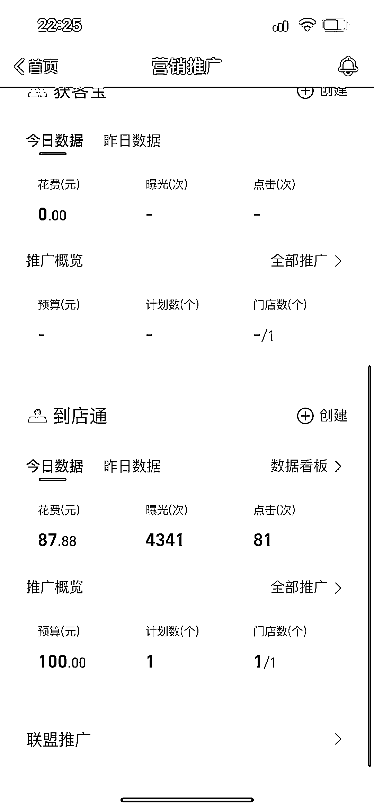

# 高德地图合作，本地生活投放的精准广告

> 原文：[`www.yuque.com/for_lazy/xkrm14/lullerglqh8y14a3`](https://www.yuque.com/for_lazy/xkrm14/lullerglqh8y14a3)

<ne-text id="ud9984cd3">作者： 你好大吴</ne-text>

<ne-text id="uc8d63eb3">日期：2023-06-12</ne-text>

<ne-text id="ua843ef18">点赞数：</ne-text><ne-text id="u4245c264" ne-bold="true">105</ne-text>

<ne-hole id="u557c80bf" data-lake-id="u557c80bf"><ne-card data-card-name="hr" data-card-type="block" id="LTtSJ" data-event-boundary="card">

<ne-text id="u1b722226">正文：</ne-text>

<ne-text id="u88ef6b2a">本地生活 高德地图 目前如果有一线城市开店的， 1.美容 2.按摩 3.洗浴 4.有大包厢属性的，在各大展会附近的餐饮店 5.团建场地</ne-text> <ne-text id="u00648325">6.跟差旅相关的业务线 7.跟有车一组男性挂钩的业务线</ne-text> <ne-text id="ud4f77c71">这以上品类，合作高德地图，是真的数据太好了，投产比很精准，最主要的是广告两个字，在这个里面还没有被强行加上“广告”就是你的投放不会被正常人认定为是广告。</ne-text> <ne-text id="u9fee4aa1">目前我已经两家店在合作了，真的，上面的用户画像太明确了，男性，开车，出差，不用美团点评抖音的，但是有强消费意愿跟需求的，会在高德地图上面搜，还有就是高德地图的活跃人数，早就过亿了。</ne-text> <ne-text id="u1dbac4d3">本地生活遍地开花的今年，大家可以试试高德地图了，cpc 点投产比很得劲很得劲。 强烈推荐！不会来问我，但是你要懂什么是 cpc 或者百度的是直通车</ne-text> <ne-text id="uef2b1353">或者是抖音来客的本地推 或者是外卖的点金推广 或者是朋友圈跟小红书的信息流</ne-text> <ne-text id="u9f074cb4">来问我，我跟你免费说～目前在我用了这么多的平台里面，投产比最舒服的了。因为玩的人太少了，而且最重要的是，用户很难感受到你在砸广告给他。</ne-text>

<ne-card data-card-name="image" data-card-type="inline" id="VEsQS" data-event-boundary="card"></ne-card>

<ne-card data-card-name="image" data-card-type="inline" id="Qx2mt" data-event-boundary="card"></ne-card>

<ne-hole id="u24c22f03" data-lake-id="u24c22f03"><ne-card data-card-name="hr" data-card-type="block" id="LKwkk" data-event-boundary="card">

<ne-text id="u86998ab5">评论区：</ne-text>

<ne-text id="uf9522053">张五哥 : 有意思，加个微信学习下 lz65536</ne-text>

<ne-text id="uf139c18e">弃天 : 看来是新的机会，我有美容类的实体商家，加个微信学习下 feiji527</ne-text>

<ne-text id="u7716cc08">你好大吴 : 我的 V，HIFM23，备注一下，来自生财哈～</ne-text>

<ne-text id="u7bf8e0de">你好大吴 : [OK]</ne-text>

<ne-text id="uba9f0e9c">鞋鞋 : 我发现高德有“我的店铺”的时候已经有人变现了[捂脸]</ne-text>

<ne-text id="uecf92492">乔合 : 怎么联系</ne-text>

<ne-text id="u671a78ad">你好大吴 : 再次说一下哈，跟实体经营有关系的，就是实体经济。本地生活板块，你需要有营业执照➕对应行业的许可证才能做～</ne-text>

<ne-hole id="u2751eed9" data-lake-id="u2751eed9"><ne-card data-card-name="hr" data-card-type="block" id="j4WlK" data-event-boundary="card">

<ne-text id="u18545aec">公众号懒人找资源，懒人专属群分享</ne-text>

</ne-card></ne-hole></ne-card></ne-hole></ne-card></ne-hole>