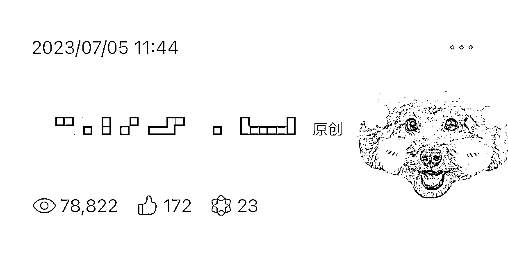

# 公众号流量主仍然有潜力，快速上手成本低

> 原文：[`www.yuque.com/for_lazy/xkrm14/cy64rb4grl47tps1`](https://www.yuque.com/for_lazy/xkrm14/cy64rb4grl47tps1)

作者： 巴菲

日期：2023-07-06

点赞数：91

正文：

公众号流量主还可以做吗？ 可以做，最近我们的账号爆了好几个，附图昨天的爆款图文，一篇文章时间成本 5 分钟，GPT + SD，小白也能快速上手，门槛极低，一天就能跑通整个流程

评论区：

赵弘凯 : 这是做的什么内容啊大佬？

参商 : 是美女图吗？感觉最近流量好像越来越少了呀

云端 : 真的只要 5 分钟？我每篇都搞半小时[吐]

fish : 能持续吗，还是新手扶持

韩小枫 : 感觉入场的人越来越多了，流量有变低的趋势，还是要思考流量枯竭之前还能干点啥

晨哥 : 不懂就问，SD 是什么软件

小羽 : 老板，我也发现了，最近爆的少了，你那边是吗

参商 : 是的呀，加个 V 交流一下吧

