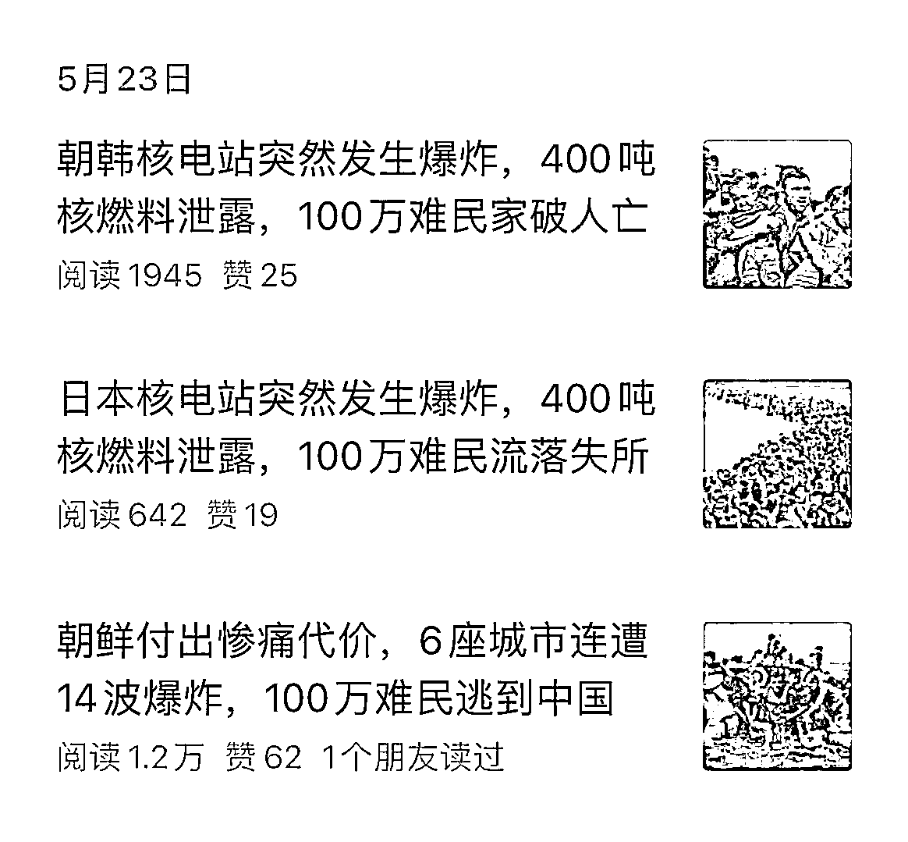

# 老年群公众号链接揭示惊人真相：AI 写作成为营销号的终极造粪机器

> 原文：[`www.yuque.com/for_lazy/xkrm14/bcuuubuxccc2li7r`](https://www.yuque.com/for_lazy/xkrm14/bcuuubuxccc2li7r)

作者： 程稳健

日期：2023-07-05

点赞数：73

正文：

来自某老年群的公众号链接，深挖后发现是公众号矩阵。 AI 写作，营销号的终极造粪机器。 逆天标题，逆天图文。最可怕的是每篇公众号文章都是 10w+浏览量 最后还不忘恶心小马哥一手，用名人亲戚做信用背书

评论区：

九歌 : 这个牛啊

波哥 : 都搜不到了。。。

程稳健 : 提供思路[阴险]

波哥 : 这种造谣的容易被请喝茶，他主体都是个体户，对老马有很深的怨念，说明被封了不少号

晨枫 : 那些名字承包我一天的笑点

豆豆 : 笑死了哈哈哈哈

胖大魔 : 哈哈哈，小马哥太[呲牙]

