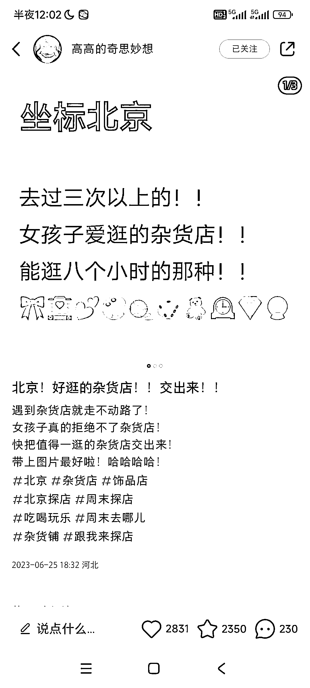
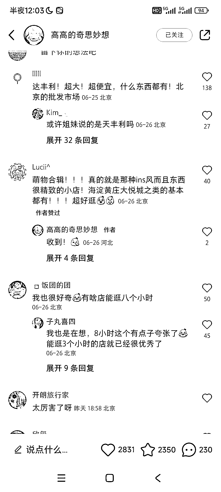

# 如何获取本地生活信息？

> 原文：[`www.yuque.com/for_lazy/xkrm14/hg0hc3r07wxpltgb`](https://www.yuque.com/for_lazy/xkrm14/hg0hc3r07wxpltgb)

作者： 云舒（小红书掘金）

日期：2023-07-04

点赞数：79

正文：

本地生活想获取信息怎么办？提出一个好问题 然后整理好了在做别的[发呆]

评论区：

伟业 : 解读：本地生活领域内容获取的一种流量形式。利用小红书高互动的特点，抛出问题，获取到内容，整理好之后就可以输出为本地信息差，通过广告来变现

云舒（小红书掘金） : 对的 是个很不错的方法😂

云舒（小红书掘金） : 谢谢老大[呲牙]

