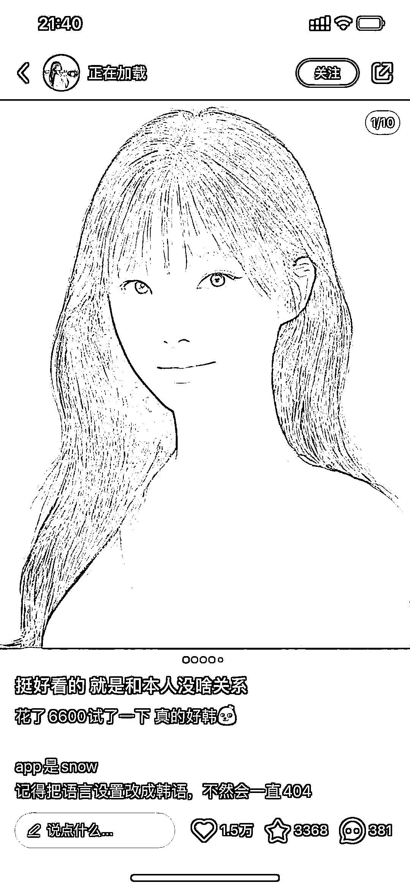
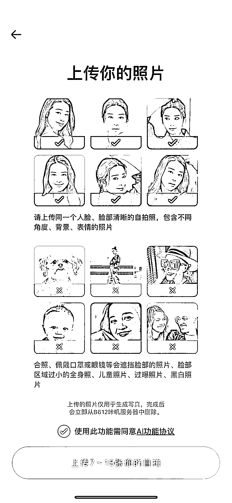

# 小红书热门话题：AI 韩式证件照软件上线

> 原文：[`www.yuque.com/for_lazy/xkrm14/nmlqqamfuc7adlam`](https://www.yuque.com/for_lazy/xkrm14/nmlqqamfuc7adlam)

作者： 月起星九

日期：2023-07-04

点赞数：59

正文：

最近小红书比较火的一个话题，snow 软件出了 AI 韩式证件照，snow35 元 10 张左右，国内版叫 B612，两个是一家公司，也出了两档，标准和特快，不超过 10 元。软件只要上传 7～15 张图即可。 1、和以前的不同：原来国内小程序的版本，一般都是上传图然后还需要按照证件照的姿势去拍一张，最后只出一张图。 这个是上传图像后不需要照着姿势拍，而且会出 30 张图。 2、机会：小红书话题比较火，做 AI 摄影项目的，如果效果能够做得更好，可以出对比图、带相关话题，去相关笔记底下评论，来带流量。 还可以拿她的证件照图，直接用自己的技术生成人脸进行对比。

  

  

  

  

评论区：

月起星九 : 哇谢谢亦仁，第一次中标，继续努力

书情小跟班 : 这个还要多角度拍摄 mj 生成韩式证件照然后换脸不更高效？

月起星九 : mj 的效果太差了吧，你觉得真实吗

无想 : 哈哈，这样省得去拍艺术照了

月起星九 : 对啊，这就是 AI 摄影项目

Alex : 恭喜中标[呲牙]

