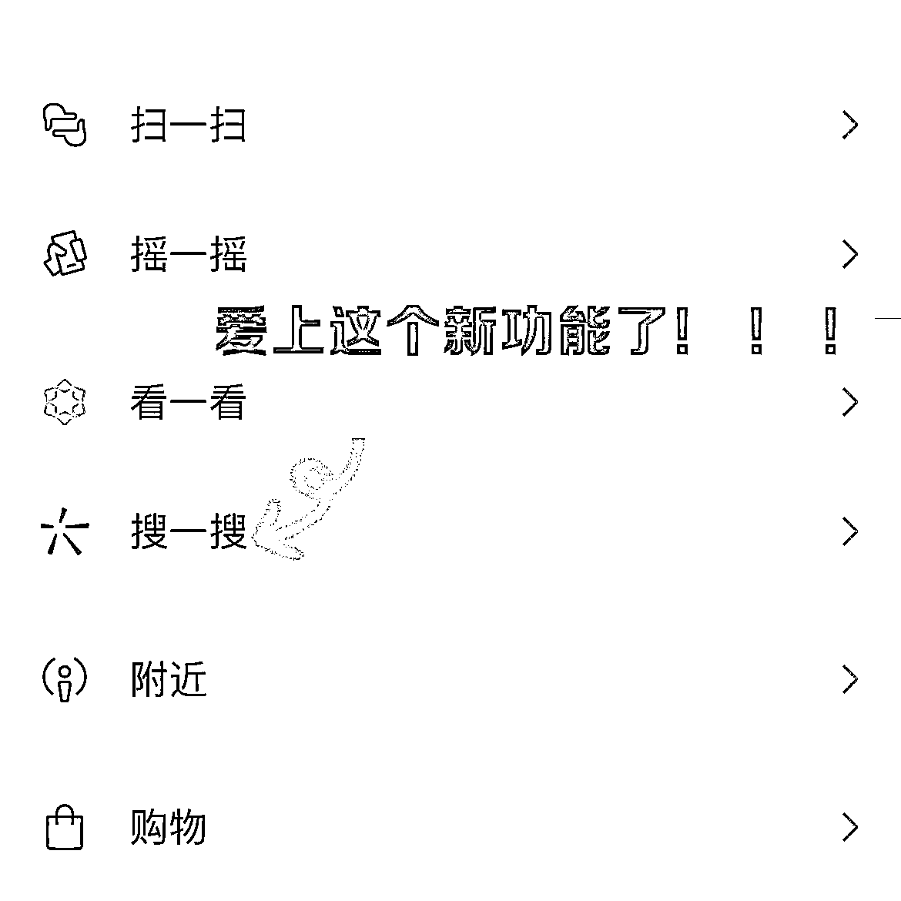
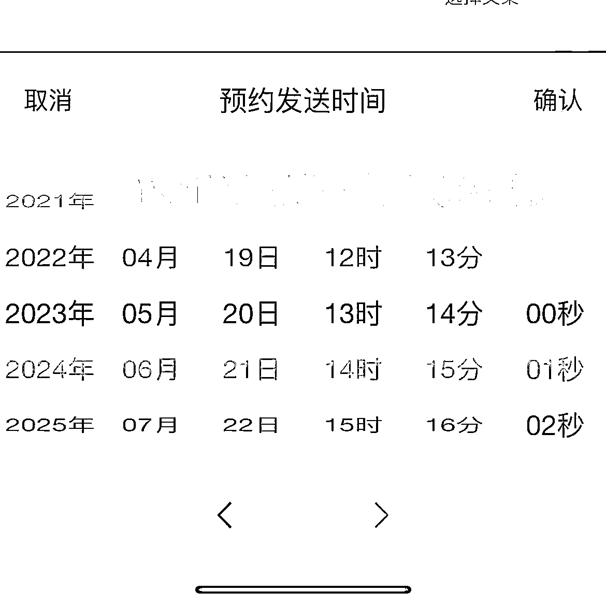
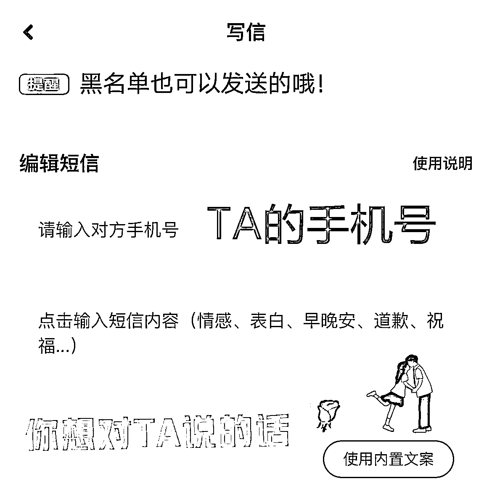

# 闷声发财的公域引流公众号的小项目，切中痛点引来高活性用户

> 原文：[`www.yuque.com/for_lazy/xkrm14/lq11v2pl3gkh7yxm`](https://www.yuque.com/for_lazy/xkrm14/lq11v2pl3gkh7yxm)

作者： 悦佬

日期：2023-07-04

点赞数：111

正文：

闷声发财的公域引流公众号的小项目！ 一、突然的发现 抖音最近冒出来一些引流到公众号“传话专家”的人，刷到了三个号，每天只需要无脑怼一个模板的图文 or 视频从公域引流，切谈恋爱分手被拉黑的、暗恋不敢表白的、想骂老板又不敢的等等人的痛点（确实挺痛），就有一大批人去公众号关注并下单。 二、深入的扒玩法 扒了一下，目前他们的变现形式主要有 2 种 1.短信传话一次 1.88，人工传话一次 9.9，发图片另收费 2.广告主收益 虽然无法看到后台变现情况，但基于人性角度分析（切中客户很痛的痛点）加上他们疯狂铺号的情况来看，收益比较可观。（公众号只发了三篇文章，前两篇 5 月 30 日发送 1000 多观看，最后一篇 6 月 30 号发送 6000 多观看，一个月引流至少 5000＋高活性用户） 三、项目逻辑通畅 这个项目，个人认为从视频制作→公域引流到私域→变现逻辑很清晰，唯一的难点就是公众号短信系统的搭建，懂行的朋友可直接复制

  

  

  

  

  

  

评论区：

九歌 : 匿名短信

伟业 : 这个和前面的匿名短信项目应该是差不多的。

朱朱侠 : 把这个生日做成视频形式的岂不是更好，让送祝福的人提供一张个人照片+祝福语，用 ai 工具把照片做成会说话的视频，在生日当天，在当地城市的地铁站投放这个生日祝福，这可比花 200 块钱买个大同小异的礼物要来的更有意思。

潮州痞子蔡 : 和当年 sp 的陌生表白短信一样的原理，当年 sp 的很多创意现在依然能用

刘卡卡 : sp 是啥

徐同学 : 查了一下是信息服务商 ，service provide ，应该是发短信的渠道，发一些你中奖了类似的点击领取。

… : 短信系统不用搭建，直接买短信服务

