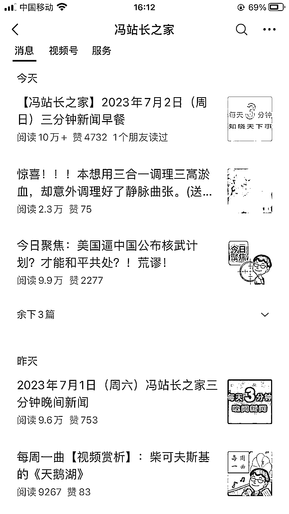
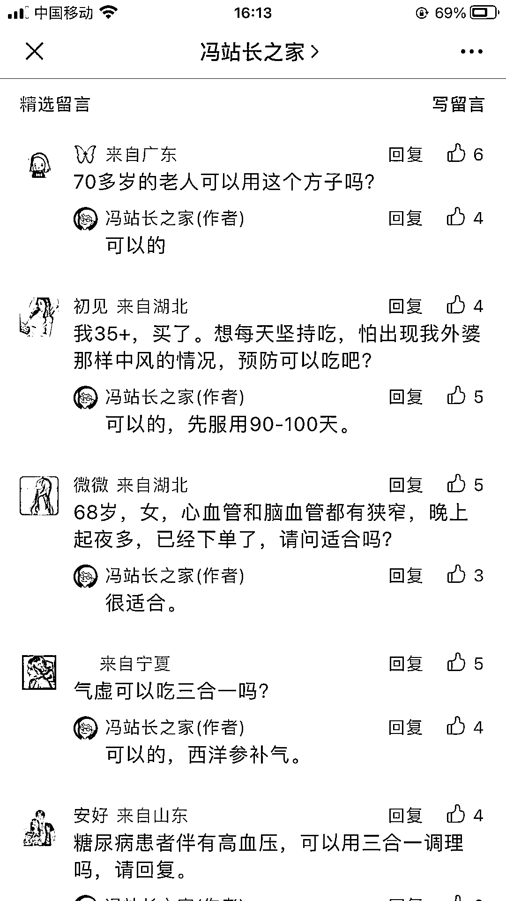

# 中老年人市场：简单粗暴，利润高，退货率低

> 原文：[`www.yuque.com/for_lazy/xkrm14/egryicg09h6cgoxs`](https://www.yuque.com/for_lazy/xkrm14/egryicg09h6cgoxs)

作者： 大雨

日期：2023-07-03

点赞数：100

正文：

中老年人市场，简单粗暴利润高。 刷到这个公众号，点进去感觉排版简单，但是特别对中老年人的胃口，每天发出来的文章，第一篇基本都是 10w+。评论区购买意向强的客户有很多，有的是子女给父母买，有的是中老年人自己买。点进栏目里面的线上商场，单看牙膏这一栏，86 元牙膏，销量 22w+，0 差评。 并且感觉中老年人退货率和差评率都很低。商品评价那一栏，即时是 1000+的客单价的产品，也没有差评。不仅仅是因为老年人不会退货，根据自己对家里长辈的观察，老年人会更有同理心，站在商家的角度上去考虑，怕退货麻烦别人。

  

  

  

  

  

  

评论区：

伟业 : 解读：中老年市场是相对好赚的一个群体，可以认真做一下。重点领域在 公众号，头条号和视频号，用户群体年龄都偏大

镜泊森源 : 这是一个头部大号。

波哥 : 这号有些年头了，头部大号

爱飞的鱼 : 头部大号不缺流量，卖什么都行！

