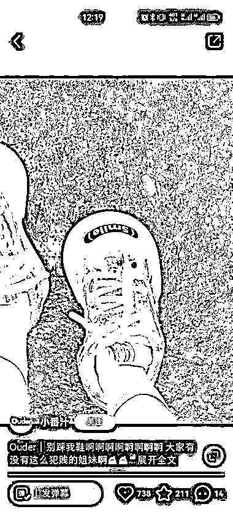

# 新品牌 ouder 瞄准中高端人群，专注少女风板鞋市场，销量已达 600w

> 原文：[`www.yuque.com/for_lazy/xkrm14/nx85xbikg31qwuwe`](https://www.yuque.com/for_lazy/xkrm14/nx85xbikg31qwuwe)

作者： 凌州

日期：2023-07-05

点赞数：66

正文：

瞄准特定人群去做细分赛道切入 ouder，一个新品牌 今年 6 月 21 日申请商标注册 看地址是莆田工厂代工 只做这种动漫可爱风格的少女风板鞋 抖音、小红书皆是 3 月起号 抖音销量 1.4w，淘宝销量 1k 客单价 400-500 之间 算是定位中高端人群了 只算这两个平台销量 GMV 已达 600w

  

  

  

  

  

评论区：

公众号懒人找资源，懒人专属群分享

