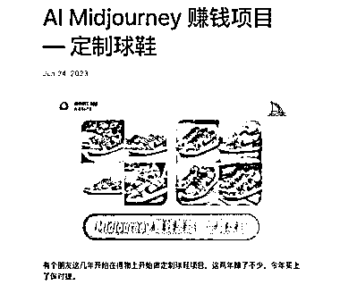

# 定制球鞋赚钱思路：从经典款到手绘定制，轻松翻倍利润

> 原文：[`www.yuque.com/for_lazy/xkrm14/ndhni19un3e11ryg`](https://www.yuque.com/for_lazy/xkrm14/ndhni19un3e11ryg)

作者： 强哥手记

日期：2023-06-28

点赞数：106

正文：

分享个赚钱的思路，也是朋友沟通而来，做部分参考吧： 朋友去年在得物上开始做，今年买上了保时捷。 介绍这个 AI 赚钱思路：定制球鞋 首先选择经典款的球鞋，比如 Nike 的 Dunk 系列， 知乎、抖音学习定制鞋打孔，手绘，贴牌等技巧。 最关键的是，在引流时，可以用 MidJourney 生成大量手绘图，发到闲鱼、小红书等渠道，先获客后再进行定制， 这种一般都是预交费，两周到四周的时间交货，免去了自己库存的风险。 一双 700 块的球鞋，经过定制，价格都是翻倍的。 短期内还是一个很好的赛道。

  

  

评论区：

伟业 : 产品交付的成本会不会很高？

强哥手记 : 核心是和商家确定好。产业链我觉得比较重要

天择 : 这种东西贴牌不算售假嘛？

字节叔叔 : 鞋子是正品鞋子（比如正品√），只是在鞋子上进行手绘。

弃天 : 打孔、手绘、贴牌等技术活有没有渠道可合作？

天择 : 哦哦，谢谢指数

🌲jungle : 定制球鞋还是挺小众的，看得物上的订单销售量也不高，另外产品交付也会容易起纠纷。这应该不算是特别好的机会。

