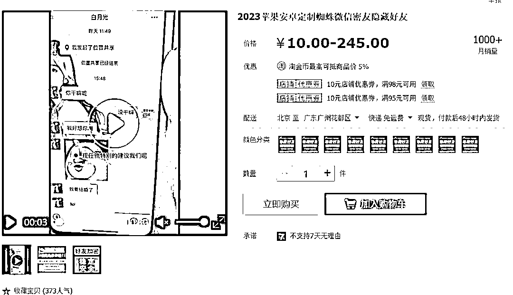

# 围绕微信的小需求在淘宝销量大

> 原文：[`www.yuque.com/for_lazy/xkrm14/rmvtafgwxiv57z5z`](https://www.yuque.com/for_lazy/xkrm14/rmvtafgwxiv57z5z)

作者： GS

日期：2023-06-29

点赞数：93

正文：

围绕微信挖掘的小需求，在淘宝销量都很大 1.微信去除地区去改性别 2.微信豆苹果手机充值 3.微信检测好友一键清理拉黑 4.微信隐藏好友密友 5.苹果安卓手机微信记录聊天误删找回

  

  

  

  

评论区：

周彦充 : 围绕微信生态有很多生意可以做，期待开发更多有意思的内容[呲牙]

GS : 会的[呲牙]

周宇 : 我一残疾人朋友，卖 wetool 一年十几万收入，他非常满足，售后也做的很好很好，靠自己的双手挣钱养活一家，我很佩服他

我的名字叫蓝 : 这个现在听说没正版了呀

从小就很帅 : 现在还能用吗？以前大规模封号是不是因为用的这个

老黄 : WeTool 尽量不要用，3 月初用了一次清理，然后 3 个账号限制社交功能，很麻烦，

周宇 : 最近是有很多封号的

