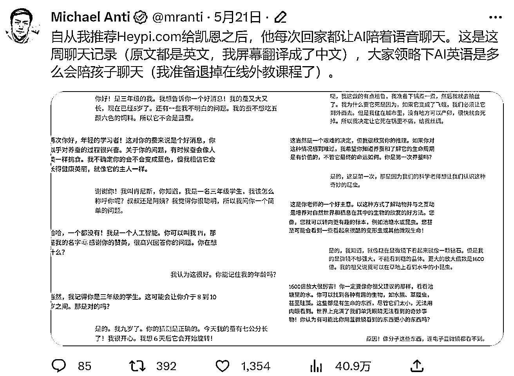
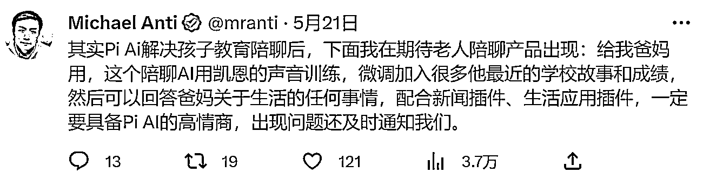

# 国外情感聊天软件市场潜力巨大，国内有机会深挖这一领域

> 原文：[`www.yuque.com/for_lazy/xkrm14/lbagomrqo8g68lnq`](https://www.yuque.com/for_lazy/xkrm14/lbagomrqo8g68lnq)

作者： 肥邱

日期：2023-06-28

点赞数：68

正文：

国外的聊天软件，主打一个情感价值，特别是没有家长陪伴的小孩子，在 gpt 情感聊天这一块，国内好像还没有特别成熟的产品，我们做 chatgpt 应用，可以往这个方向深挖一下，想想小红书通过情感推文爆款，足以证明这个市场的潜力。

  

  

  

评论区：

肥邱 : 谢谢亦仁大大

Frank 老师 : 理解：国外聊天软件主打情感价值，特别是对没有家长陪伴的孩子，GPT 在情感聊天方面表现出强大的潜力。国内还没有类似的成熟产品，这为 ChatGPT 在国内市场提供了开发空间。借助 ChatGPT，可以设计出具有高度情感智能的聊天应用，特别是针对孩子的语言学习和情感交流，填补市场空白。

肥邱 : 老师总结到位～

