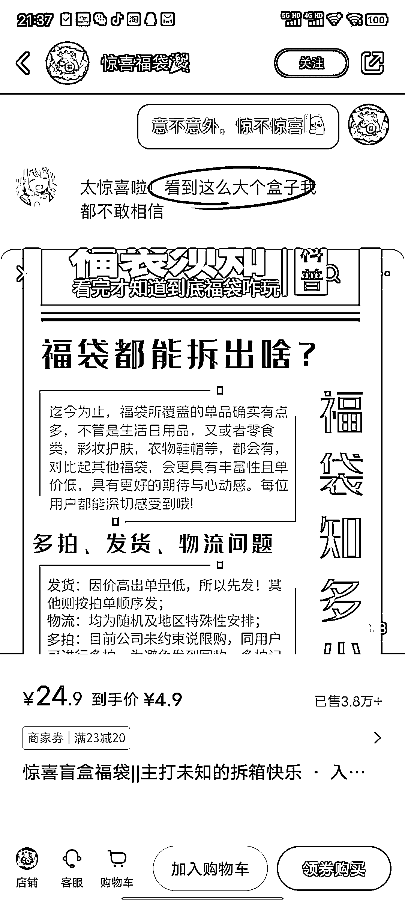
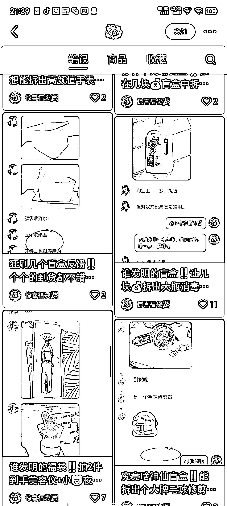
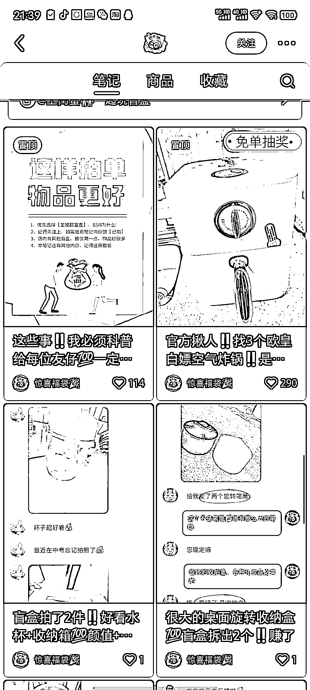

# 盲盒玩法火爆，小红书店铺销量破纪录

> 原文：[`www.yuque.com/for_lazy/xkrm14/fp3gbhth5i5yentx`](https://www.yuque.com/for_lazy/xkrm14/fp3gbhth5i5yentx)

作者： 四月

日期：2023-06-28

点赞数：69

正文：

盲盒的玩法 在哪里都很火。 小红书里的一个店铺 4.9 一个盲盒，售出 3.8w 个。铺笔记很简单。笔记都是发一些盲盒里客户反馈的内容。 只要有一些正反馈，就可以持续无脑做下去

  

  

  

评论区：

雅士哥哥 : 货源哪里弄

花满楼 : 货源哪里弄

xing : 货源售后都可以去别的平台

Frank 老师 : 理解：盲盒模式因其神秘感和惊喜性在各类平台都受到热捧。店铺通过售卖低成本盲盒并在小红书分享客户反馈内容，从而实现了大量的销售。只要保持一定的正面反馈，这种模式可以持续高效运营。借助 ChatGPT，可以自动化处理大量客户的反馈信息，并进行情感分析，有助于优化产品和提高客户满意度。

