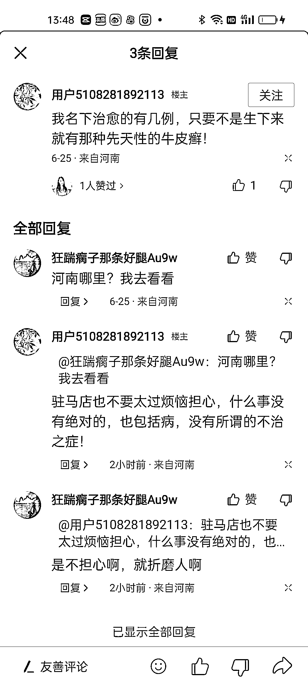
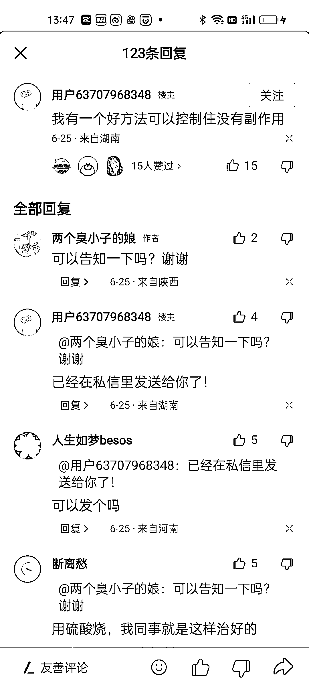

# 评论引流：有效避免删除和封号的方法

> 原文：[`www.yuque.com/for_lazy/xkrm14/rhy4ilad534svwub`](https://www.yuque.com/for_lazy/xkrm14/rhy4ilad534svwub)

作者： 老船长李阳

日期：2023-06-26

点赞数：63

正文：

评论引流，对于一些网络要求比较严格，经常容易删除或者被封号的内容。评论引流是一种不错的方法。论引流需要注意: 1.一个账号一天不要评论太多，最多十条 2.评论时间要分开，不要集中在一个时间点评论多条 3.评论的内容不能重复，可以事先写好 50 条内容循环发 4.合理的利用好留微信的方法，不然容易被删除，甚至被封号或者被封私信

  

  

  

  

  

评论区：

周彦充 : 感觉这个很香，可以好好研究下

非驰 : 就是截流吗

互联网｜老张 : 这应该算是截流一种

田小田的甜 : 这是自问自答吧

陈工 : 主动曝光截流评论区我们一直都在做，我们通过的是软件工具，可以解放我们的双手，而且还可以多个号批量操作

千幻 : 楼下陈工,就相当于一种截流~

千幻 : 这是啥平台老哥

公众号懒人找资源，懒人专属群分享

