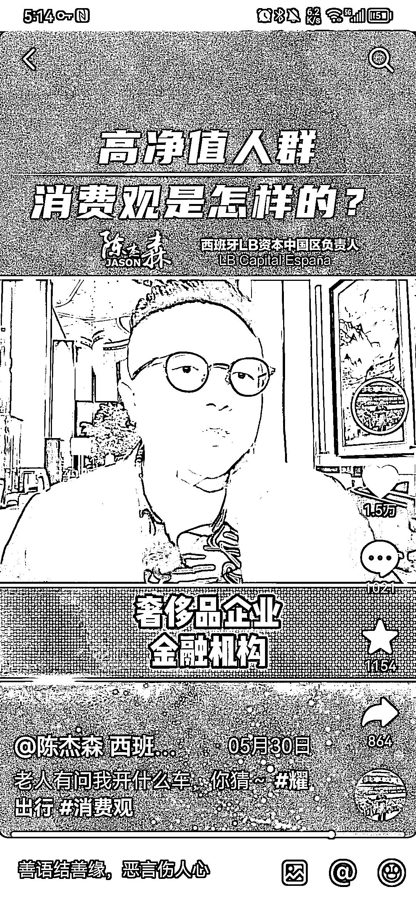
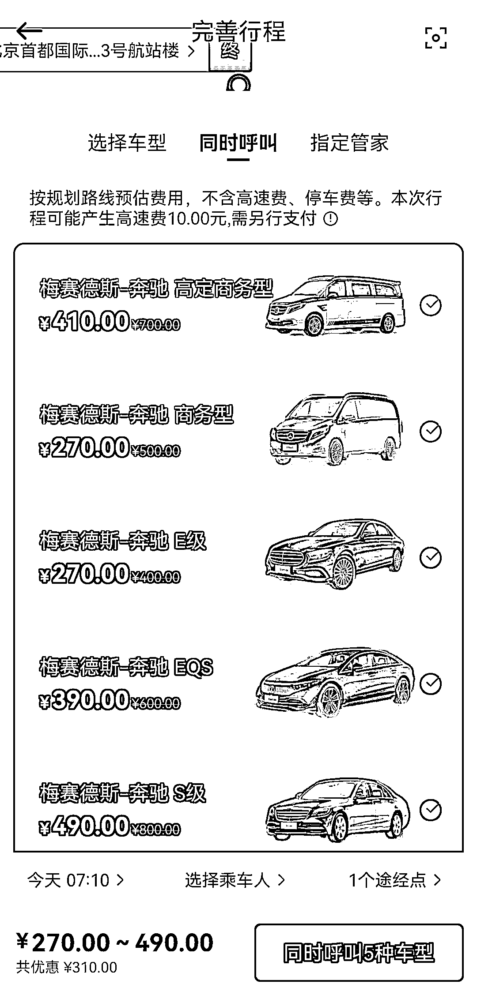

# 耀出行 app：豪车出行赛道的新选择

> 原文：[`www.yuque.com/for_lazy/xkrm14/ftnv8zcwo5mhizmi`](https://www.yuque.com/for_lazy/xkrm14/ftnv8zcwo5mhizmi)

作者： 勤学力行

日期：2023-06-27

点赞数：38

正文：

耀出行 app 值得下载测试；豪车出行赛道 上一篇风向标讲了面向普通大众和面向有钱人群这两条不同的赛道，这一篇是后者的延续 比如普通大众使用滴滴打车的频率都在下降，但是面向有钱人群的豪车出行赛道却在有序发展。 通过图 1 的介绍，下载测试了耀出行 app。 1、里面的车，最低是奔驰 E。 2、车好 + 专业的礼宾司机服务，是核心卖点。 3、toC 用户群，老板、金融小鳄、大厂高管；toB 用户群，著名咨询公司、奢侈品企业、金融机构。 4、从北京朝阳区酒仙桥到 T3 航站楼，价格在 270-490 元之间，重要的接待可以接受。 5、还有私人飞机打飞的服务，价格普遍在 10-20 万之间。 所以生意要打开思路，面向大众人群、面向有钱人群的业务，是截然不同的商业思路。 面向有钱人群的各种业务，值得深挖。

  

  

  

  

  

  

评论区：

贝壳 : 未来的滴滴司机都要去买奔驰才能接单？

勤学力行 : 可以完整看一下第一张图里的视频，你就知道这个问题的答案了

公众号懒人找资源，懒人专属群分享

