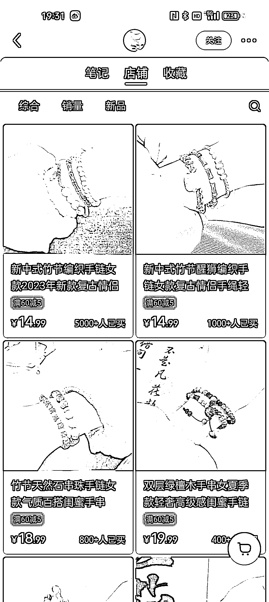
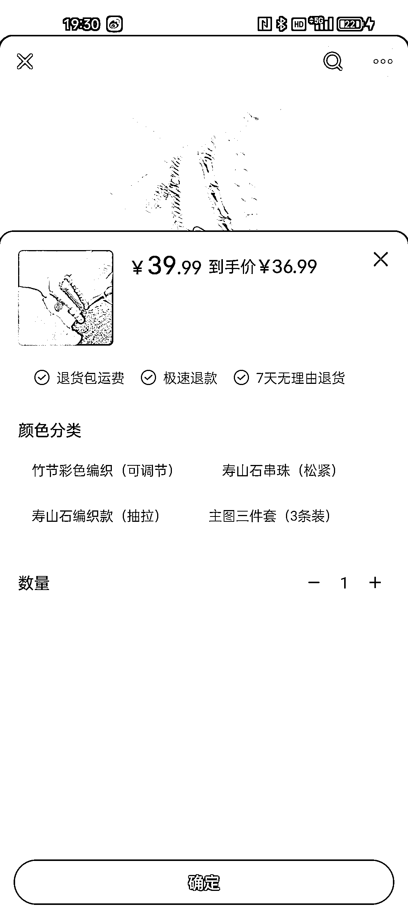

# 小红书卖首饰，玄学风格照片吸引众多购买者

> 原文：[`www.yuque.com/for_lazy/xkrm14/vw3hwhqzpw8m2pnw`](https://www.yuque.com/for_lazy/xkrm14/vw3hwhqzpw8m2pnw)

作者： 沐琳

日期：2023-06-29

点赞数：67

正文：

小红书卖首饰，买的人还不少，小红书很吃这类风格的照片，最好玩法是跟玄学挂钩，客单价提高，弄些设计款 diy 款，客户粘性很高的，人家买的是服务审美，不掉进卷价格的坑里。

  

  

  

  

评论区：

BLUE : 杭州西湖边上的寺庙玩的很 6

Frank 老师 : 理解：小红书上销售首饰的模式成功地提升了客单价和客户粘性，其关键在于结合审美服务与玄学元素，避免陷入价格竞争。同时，新中式设计和 DIY 元素也吸引了大量购买者。

闫君 : 讲讲呗[呲牙]

李天心天总 : 哪里有货源哇

