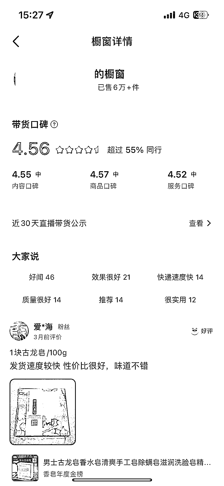
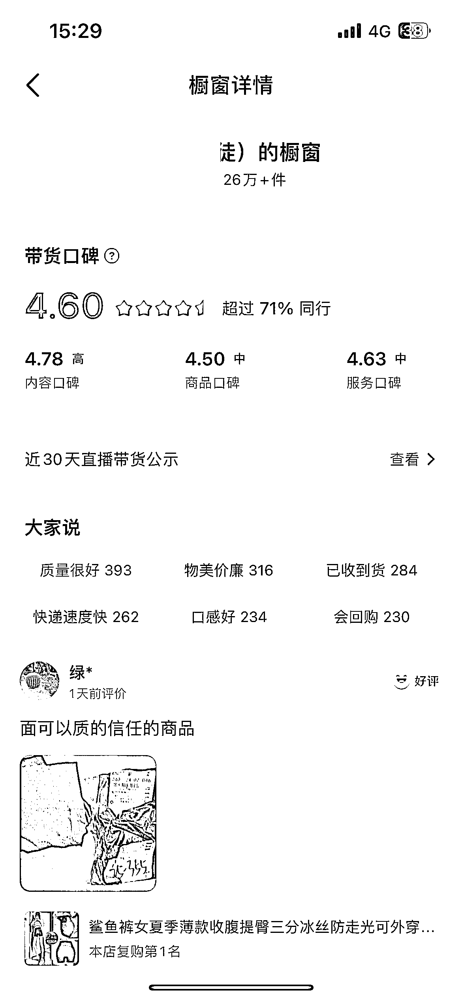

# 抖音口播带货，20 年开始兴起，橱窗带货率不错

> 原文：[`www.yuque.com/for_lazy/xkrm14/slq1bxt4rhgi9wip`](https://www.yuque.com/for_lazy/xkrm14/slq1bxt4rhgi9wip)

作者： 我是薇薇丫

日期：2023-06-28

点赞数：67

正文：

抖音口播带货 口播带货在 20 年还是 21 年的时候 这位微友就开始做了 经常刷到她晒朋友圈 今天就特地去抖音刷了几个账号 变现形式是说一些特定的文案加上混剪 看了一下橱窗带货率还不错 想做电商领域方面的圈友可以参考哦

  

  

  

评论区：

我是薇薇丫 : 谢谢亦仁大大[咖啡]

bgz 洲洲 : 我用蝉妈妈看了下最后一图的福妹，近 30 天累计销售额 100w+

贝壳 : 视频号有人这样玩好像不大行

万简 : 这么厉害啊

AT 魏诚钢 : 身边已经有朋友跑通闭环了，卖货一个月佣金 1-2 万，直播卖课卖陪跑，一个月卖 4 万左右

我是薇薇丫 : 厉害👍🏻

way : 啊，这就月入几十万了啊，太牛逼了

