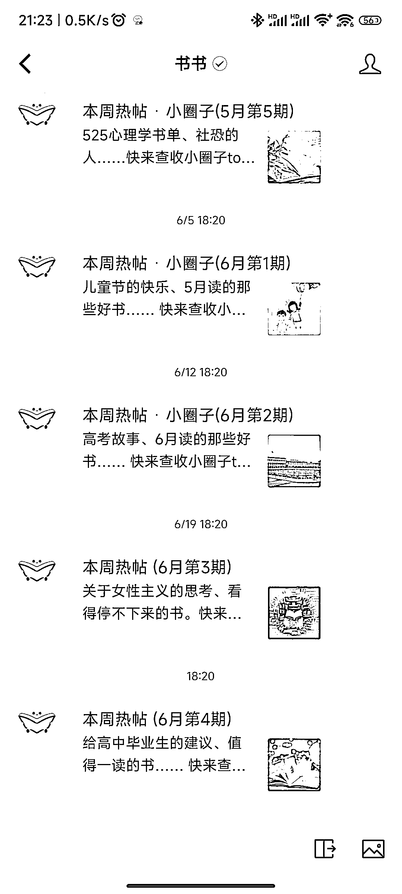
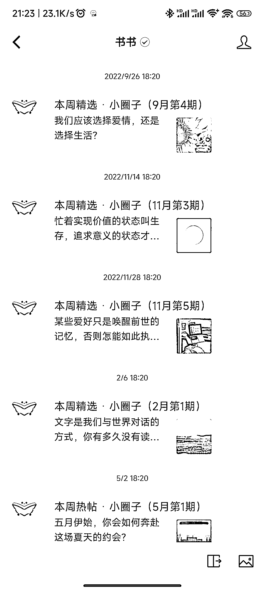
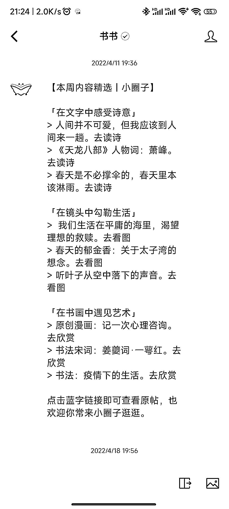
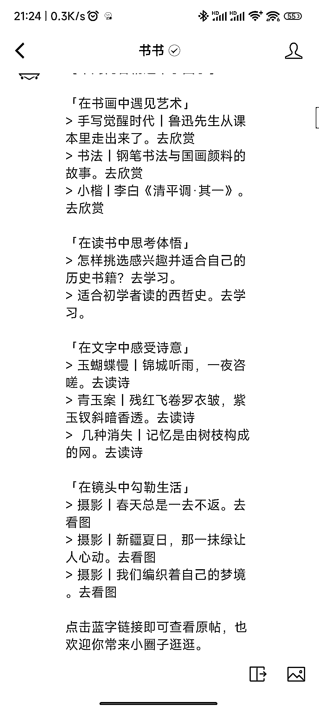
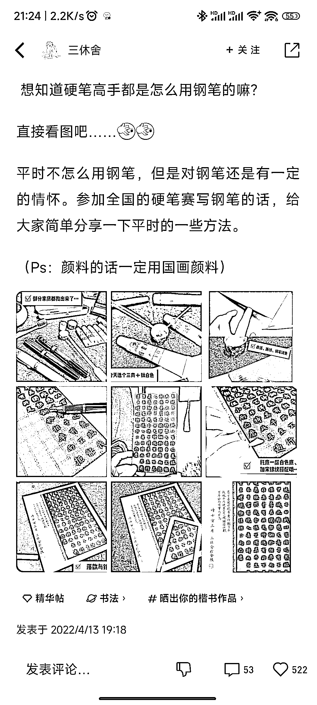

# 微信读书生态圈迁移小思路，为博主们提供素材源

> 原文：[`www.yuque.com/for_lazy/xkrm14/vo3q72v4if0u1bx7`](https://www.yuque.com/for_lazy/xkrm14/vo3q72v4if0u1bx7)

作者： 枫晓陌

日期：2023-06-26

点赞数：58

正文：

关于微信读书生态圈一个内容迁移小思路，也许对文案博主、书桌博主、读书博主们提供一个好的素材源。 订阅读书广场的“书书”，他会每周给我们推荐微信读书这一周最精彩的内容。

  

  

  

  

  

  

  

评论区：

胖大魔 : 机会

