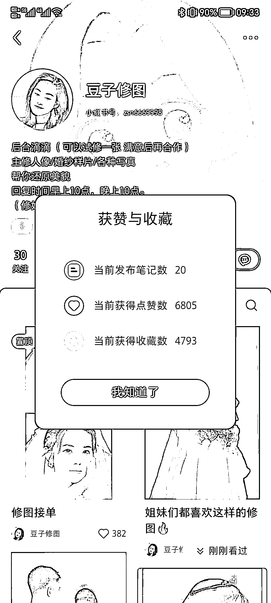

# 小红书上的 Ai 一键修图服务，适合引流和赚点小钱

> 原文：[`www.yuque.com/for_lazy/xkrm14/qg2qtzu76bapgcpe`](https://www.yuque.com/for_lazy/xkrm14/qg2qtzu76bapgcpe)

作者： 鹊起老宋

日期：2023-06-30

点赞数：75

正文：

Ai 一键修图，最近在小红书看到 Ai 修图，5 元一次，无论是用来引流还是赚点小钱都不错，关注 Ai 替代性工作。

评论区：

伟业 : 解读：帮想要修图的人，提供 AI 一键修图服务。前提在于 AI 修图的成本足够低，且无更便宜的竞争对手。类似的还有 一键获取证件照等服务

Frank 老师 : 理解：利用 AI 进行一键修图，5 元一次的服务费用可以为小红书账号引流或赚取收入

