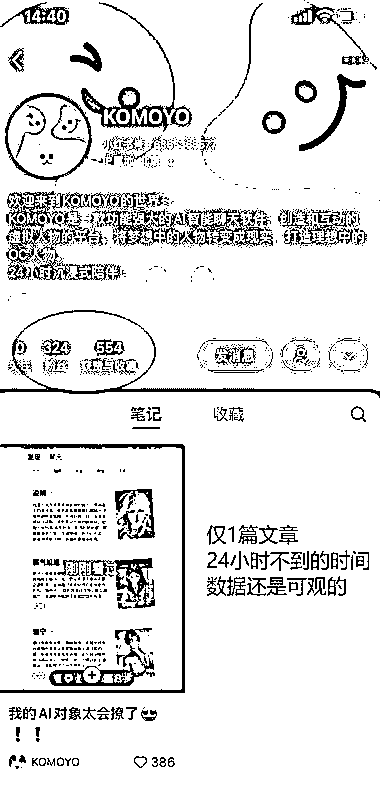
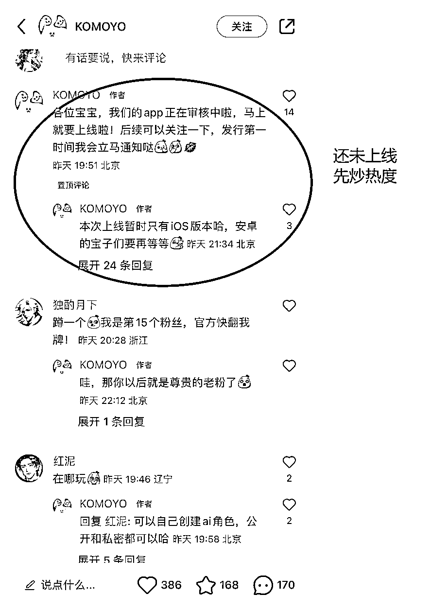

# AI 对象 APP：找到“场景”，触达用户的关键

> 原文：[`www.yuque.com/for_lazy/xkrm14/ukeiu8v1gtc8kqer`](https://www.yuque.com/for_lazy/xkrm14/ukeiu8v1gtc8kqer)

作者： 安然小姐

日期：2023-06-28

点赞数：59

正文：

【产品】AI 对象 APP 【说明】发现一款即将上线的 AI 聊天对象 APP，仅一篇文章，不到 1 天时间，流量还是不错的。评论区很多“蹲蹲”。 【思考】AI 只是工具，找到“场景”才能触达用户。

评论区：

安然小姐 : 感谢！！！疯狂开心中[跳跳]

