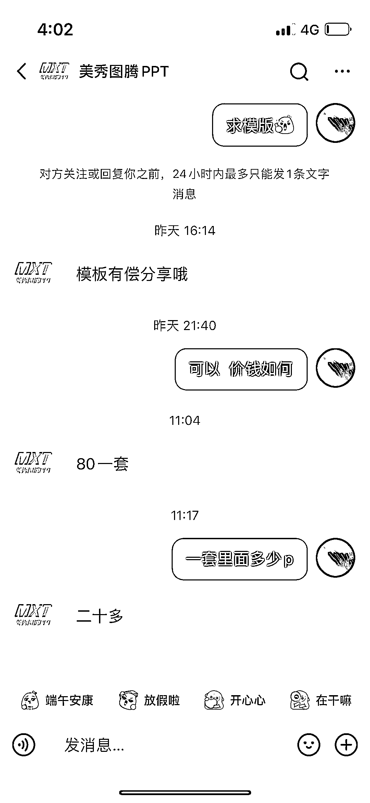

# B 端高质量 ppt 缺口大，案例参考有限，差异化高端模板可提高客单价

> 原文：[`www.yuque.com/for_lazy/xkrm14/kppktttrlrg1cmgy`](https://www.yuque.com/for_lazy/xkrm14/kppktttrlrg1cmgy)

作者： 张大蒜

日期：2023-06-28

点赞数：60

正文：

B 端高质量 ppt 缺口大，但实际可参考案例很少。目前很卷的 ppt 模板赛道都是没设计感，就素材简单堆砌的模版，这种高端的可以打出差异化，且客单价可以拉的比较高。

评论区：

张云金 _GISer : 高级定制，目前 2500 左右一页

Alex : [强][强]

万简 : 一页做多久

张云金 _GISer : 搜索下全屏本事，武超

