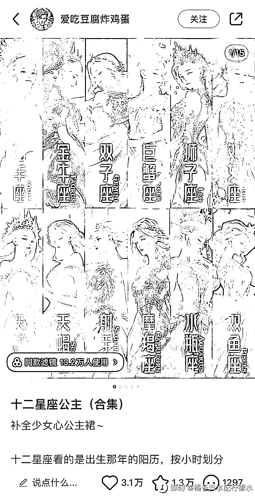
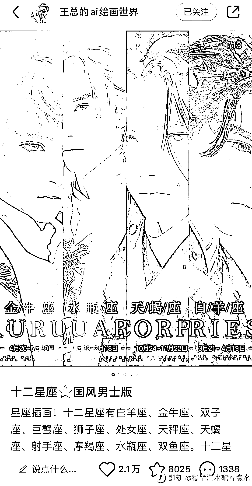

# AI 绘画星座账号：精准人群、高互动率、封面吸引力

> 原文：[`www.yuque.com/for_lazy/xkrm14/rgv3iw0qckecw5iy`](https://www.yuque.com/for_lazy/xkrm14/rgv3iw0qckecw5iy)

作者： 纳兰乘风

日期：2023-07-24

点赞数：57

正文：

AI 绘画星座类账号，现在在小红书上已经算是单独的赛道了。 它的核心就是将十二星座拟人化，代表性的帐号有 女性十二星座的@爱吃豆腐炸鸡蛋。 男性十二星座@王总的 ai 绘画世界。 这种账号主要是接定制和课程、以及广告。 这类帐号爆款的原因其实也很简单。 1.赛道垂直，人群比较精准。相比其他的 AI 绘画账号，星座类的内容人群是非常好找的。 2.互动率高。由于人群精准，加上这类型的文案，对用户性格的描写会比较精准，所以很容易激发用户的评论和点赞。 3.封面一般会做会汇总化的展示，这种类似电视剧人物的海报，极易引起用户点击和收藏的欲望。 如果只是做单篇的星座拟人图片，其实不容易爆（一般在 5000 赞以内），原因是 12 星座的合集更加容易有爽点，会大爆（10000 赞以上）。 这类账号已经能单独撑起一个类别了，但是同样爆款之后面临流量下降的困境。

评论区：

公众号懒人找资源，懒人专属群分享

