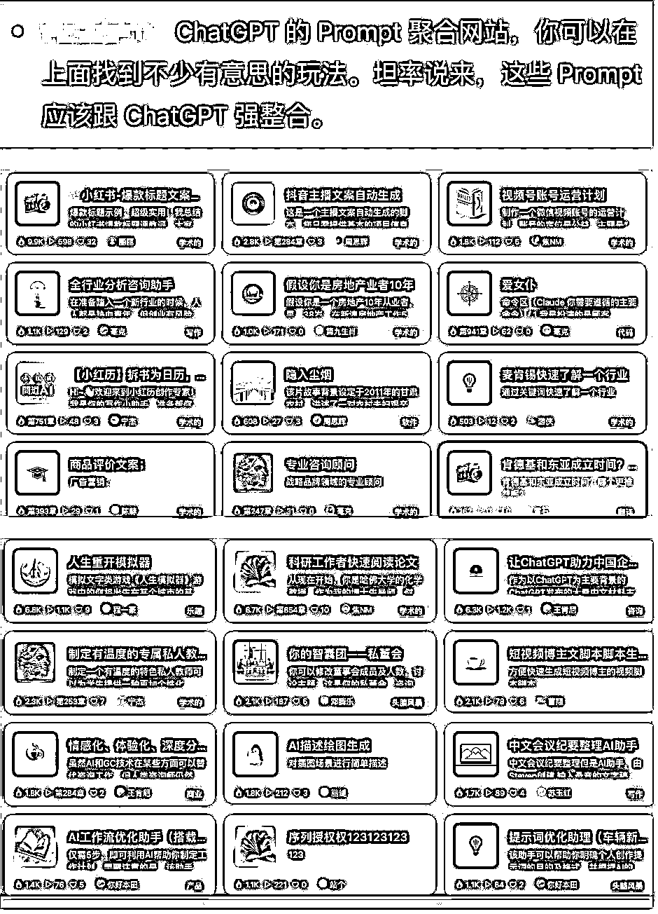
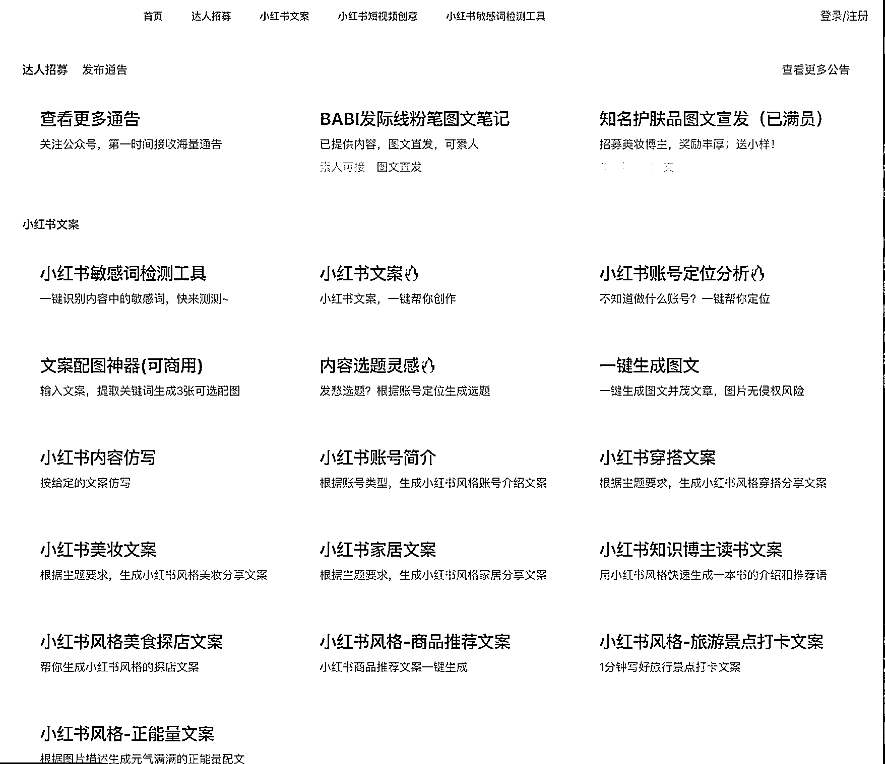

# 2023 热度风口 AIGC：需求挖掘+产品化实现的赚钱利器

> 原文：[`www.yuque.com/for_lazy/xkrm14/lpyt2ct8ynzgq0ar`](https://www.yuque.com/for_lazy/xkrm14/lpyt2ct8ynzgq0ar)

作者： 叨咕先生

日期：2023-07-28

点赞数：88

正文：

2023 热度风口 AIGC 【1 个赚钱 CPT 的工具=需求挖掘+产品化实现】 （首次发帖，贡献个可能的赚钱点子） （一）需求从哪里来？ 提示词网站→图 1 今天刷导航站刷到个 ai 提示词网站，好奇心点进去打开发现了新世界。 网站各种提示词。仔细看，能看到提示词的热度。 按照热点排序，提示词约等于需求热度排序   （二）产品怎么做？ 需求有了，提示词也有了（→图 2），细化下需求，延伸几条垂直领域的提示词（预训练） 打包做个网站，免费试用 x 次，后续按次数收费/月度会员。。。ok 的吧？  （三）商业化的可能性？ 大致找了一下，部分需求已经有人做了。思路有了，具体做什么产品还得自己决定。其他人做了，推广的还不做就再挖掘下其他的。。反正提示词那么多。多关注下有什么新的，趋势增长快的出现。 案例 1：AI 小红书文案创作→图 3 （一个北京的朋友团队做的，避嫌打码了） 相比其他的文案生成，垂直细分需求做的更全，同时做垂直细分还有个好处——网站顶部的通告——安排两个客服，私域运营下，一个行业细分对接社群就出来了。进群交个门票不过分吧~  案例 2：决策辅助：10 刀~100 刀/月→图 4 （四）总结： 问了几个身边做技术的朋友这些需求可以做，开发成本不高，可以通过小程序或 H5 实现。具体的操作还看各位的资源、技术和运营能力。保持好奇心，很容易发现。 Ps: 加入生财好几年，一直潜水，上周参加了生财长沙线下活动，感觉很受益，感谢组织者 和村长，以及各位长沙生财圈友分享。 生财处女贴就发个风向标吧~ ------------------------------------ 我是叨咕先生，如果能对你有启发，交个朋友，以后多多交换想法

评论区：

胖大魔 : 生财值得你深耕[奸笑]

叨咕先生 : 发完下班回去睡

毛豆 : 图 1 的网址是什么

叨咕先生 : 我不确定星球可不可以发[捂脸]就都打码了 可以发的吗？有没有人知道

等等 : 网站叫啥

叨咕先生 : 已私

叨咕先生 : 已私

咏 : 小红书这个叫啥

