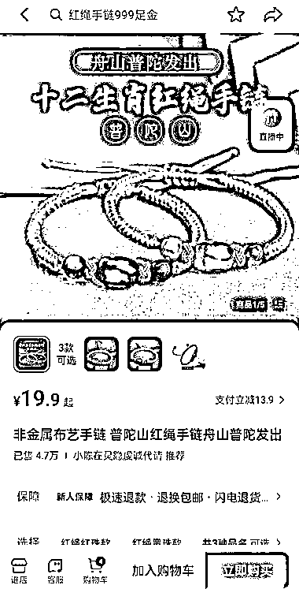

# 抖音爆款手链销量高，变现方式多样化

> 原文：[`www.yuque.com/for_lazy/xkrm14/ir6c679gc33ze4f7`](https://www.yuque.com/for_lazy/xkrm14/ir6c679gc33ze4f7)

作者： 流年

日期：2023-07-26

点赞数：62

正文：

抖音有个账号为小陈在灵隐虔诚代请，该橱窗有一款非金属布艺手链，单价为 39.8 元，销量在 2.2 万件，这款手链在抖音属于爆款。 还有一款非金属布艺手链，单价为 19.9 元，销量有 4.7 万件。橱窗的大部分手串、手链来自多个店铺，可能和店铺有合作，帮助销售产品。 手链、手串的变现方式： 1.目前正值暑假，景区游客较多，在抖音寺庙直播杭州景区现场，卖手链、手串。 2.没有店铺的情况下，线下摆摊和直播同步卖手链、手串。

评论区：

阿凯 : 不仅仅灵隐寺。香积寺，里头做直播的，差不多十几个人。

