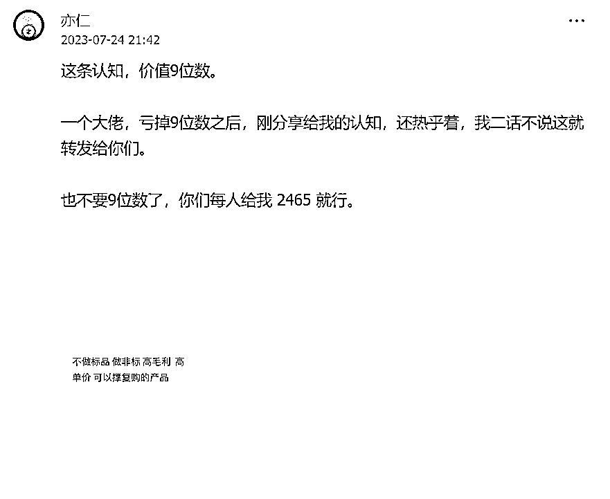
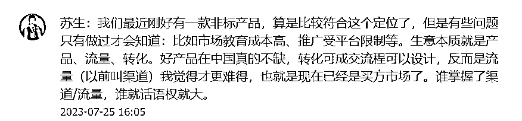
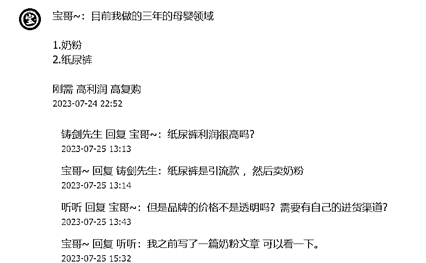
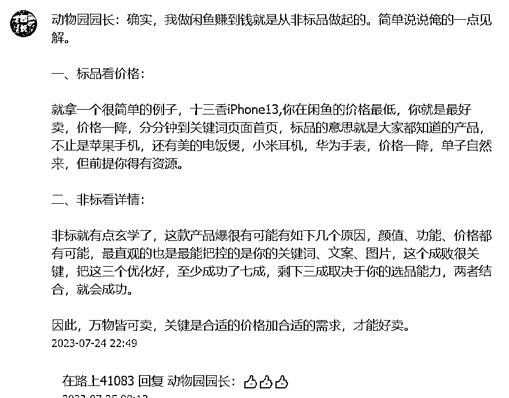

# 圈友讨论：什么是非标品？

> 原文：[`www.yuque.com/for_lazy/xkrm14/qfabf6ghtgt69ux7`](https://www.yuque.com/for_lazy/xkrm14/qfabf6ghtgt69ux7)

作者： 篮子🍀

日期：2023-07-27

点赞数：72

正文：

亦仁分享的 9 位数认知“不做标品”下面圈友的讨论，基本围绕什么是非标品展开。这个有四个标准：非标品、高毛利、高单价、复购。 圈友分享的有：GPT 分析、私域、私域白酒、知识付费、二手奢侈品、闲鱼做非标品、母婴领域、流量…等等 我感觉短剧 CPS 也算诶，虽然不满足高单价，但是其他三个以及流量渠道是比较稳定的。不过就是我搞不来流量…

  

  

  

  

  

  

  

  

评论区：

篮子🍀 : 哇🎉

