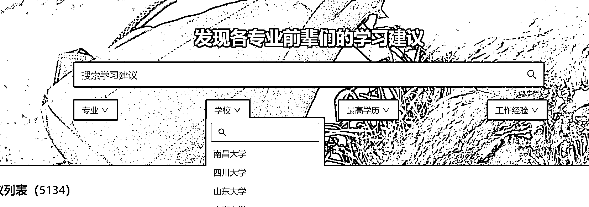

# 复旦大学博士生创建“框框大学”，分享专业经验助力高考志愿填报

> 原文：[`www.yuque.com/for_lazy/xkrm14/bfyr9rtv3l9ica3q`](https://www.yuque.com/for_lazy/xkrm14/bfyr9rtv3l9ica3q)

作者： 林元陸

日期：2023-07-27

点赞数：69

正文：

1、去年夏天，复旦大学博士生周薪吉（即 B 站 UP 主“取景框”）发起创建了一个专业经验分享网站“框框大学”。 2、该网站收集了 1881 所大学 965 个专业的学长学姐分享的经验，在 7000 多条回答中写出，这些前辈们写出了当下的就业困境。 3、在今年高考志愿填报期间，网站访问量达 45 万。周薪吉发现，这两年来，电气、人工智能专业跃升为工科里的热门，经济金融、土木工程等专业的热度显著下降。 4、我的思考：如果这年头你还想要在任何细分赛道做精准私域引流，比起拉群、运营一个自媒体账号，搭建网站、小程序、App 都是不错的“降维打击”的方法。

评论区：

胖大魔 : 真降纬打击

Kali : 我觉的这个案例赢的点在于：就业难，学业内卷等大背景下，说出了大家的心声。还有就是博主个人影响力（b 站 321 万粉丝，复旦大学博士）的冷启动。 并不是网站这种格式赢了自媒体。

一恒 : 对，网站自然流量很难搞的

出海 SEO 孔明 : 国外免费流量还行的

草木青｜灵魂核聚变版 : 哈哈哈，合理，

